# Лекция 2: Паттерны мультиагентных систем

## Введение

В предыдущей лекции мы разобрались, зачем вообще нужны несколько агентов. Но иметь агентов — ещё не значит иметь систему. Три инженера в комнате без плана — это не команда, а хаос. Нужны правила взаимодействия: кто кому ставит задачи, кто проверяет результат, как параллелить работу, как разрешать разногласия.

Эти правила взаимодействия — **паттерны**. Они делятся на две семьи.

Первая — **паттерны оркестрации**. Они отвечают на вопрос «как координируется работа». Кто решает, какой агент работает следующим? Есть ли центральный диспетчер или агенты сами договариваются? Работа идёт последовательно или параллельно? Если провести аналогию с компанией, оркестрация — это **организационная структура**: иерархия, плоская структура, конвейер.

Вторая — **паттерны коллаборации**. Они отвечают на вопрос «как агенты совместно повышают качество». Один генерирует, другой критикует. Несколько спорят и приходят к консенсусу. Трое независимо решают задачу, и побеждает большинство. Если оркестрация — это оргструктура, то коллаборация — это **командная динамика**: мозговые штурмы, код-ревью, дебаты.

Эти две семьи ортогональны. Можно взять любой паттерн оркестрации и комбинировать с любым паттерном коллаборации. Supervisor может управлять парой «генератор + критик». Pipeline может включать этап голосования. Plan-and-Execute может использовать Map-Reduce для параллельных шагов.

Важно понимать: паттерны — не догма. Это проверенные решения типовых задач координации. Как паттерны проектирования в программировании (Observer, Strategy, Factory), они дают общий язык для обсуждения архитектуры и проверенные рецепты. Но реальная система часто использует элементы нескольких паттернов одновременно.

В этой лекции мы разберём восемь паттернов оркестрации и шесть паттернов коллаборации, построим матрицу выбора и посмотрим, как их комбинировать.

---

## Часть 1: Паттерны оркестрации

### Supervisor (иерархия)

Самый интуитивный паттерн. Есть центральный агент — **супервайзер** — который решает, какой из рабочих агентов должен выполнить следующий шаг. Супервайзер не делает работу сам. Он анализирует текущее состояние, выбирает исполнителя и передаёт ему задачу. Получает результат, снова анализирует — и так до тех пор, пока задача не решена.

Принципиальная деталь: маршрутизация происходит через LLM. Супервайзер — это не жёстко запрограммированный роутер, а языковая модель с инструкцией, которая возвращает имя следующего агента в структурированном формате. Это даёт гибкость: при добавлении нового агента достаточно обновить промпт супервайзера.

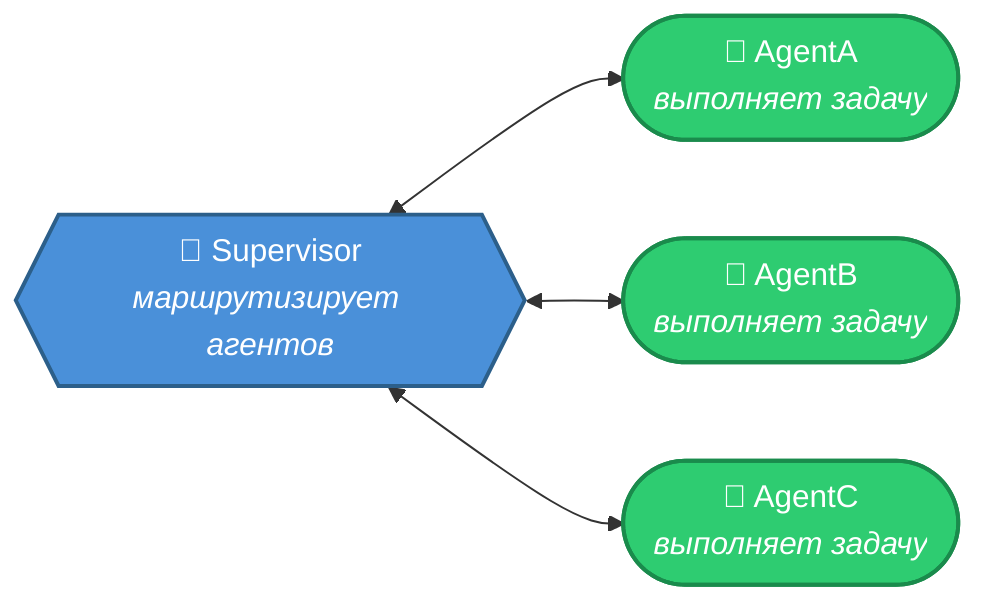

**Плюсы.** Предсказуемый поток управления — всегда понятно, кто принял решение. Легко отлаживать — достаточно посмотреть на ответы супервайзера. Простая модель расширения — новый агент добавляется в список рабочих.

**Минусы.** Супервайзер — узкое место. Все решения проходят через один узел, и если он ошибается в маршрутизации, страдает вся система. Это single point of failure: если супервайзер галлюцинирует или тайминг-аутит, работа останавливается.

**Когда использовать.** Задачи с чётким разделением ответственности между агентами. Ситуации, где важна аудируемость — кто принял какое решение. Команды до 5–7 агентов (при большем числе супервайзер начинает путаться в выборе).

> Полный пример: examples_8_2a_langgraph.py, функция example_supervisor_full()

А что делать, когда агентов больше семи? Ответ — **Hierarchical Supervisor** (иерархический супервайзер). Вместо одного супервайзера, который пытается управлять всеми, создаётся дерево: верхний супервайзер координирует супервайзеров среднего уровня, а те — своих рабочих агентов. Каждый супервайзер отвечает за свою группу и не знает о деталях работы соседних групп.

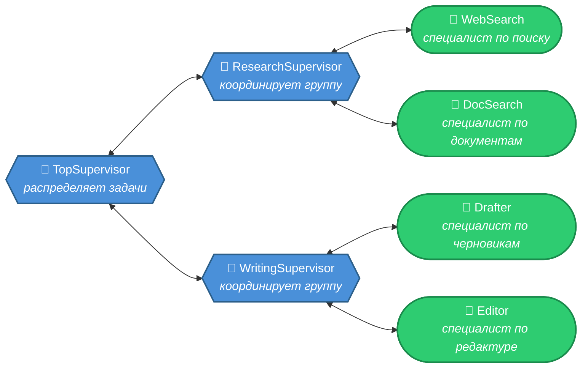

Типичный сценарий — большие системы с 10+ агентами. Верхний супервайзер решает: «нужно исследование» → передаёт супервайзеру исследовательской группы. Тот сам решает, запустить веб-поиск, поиск по документам или оба. Верхний супервайзер не вникает в эти детали — он получает готовый результат исследования и направляет его группе писателей.

В LangGraph иерархия реализуется через подграфы: каждый супервайзер среднего уровня — это скомпилированный подграф, встроенный как узел в граф верхнего уровня. Это естественное продолжение механизма subgraphs из модуля 7.

### Router / Triage (маршрутизатор)

Иногда не нужен полноценный супервайзер с циклом — достаточно один раз направить запрос нужному специалисту. Router — это упрощённый Supervisor: один маршрутизатор анализирует входящий запрос и передаёт его одному из агентов-специалистов. Специалист обрабатывает запрос и возвращает результат напрямую — без возврата к маршрутизатору, без циклов.

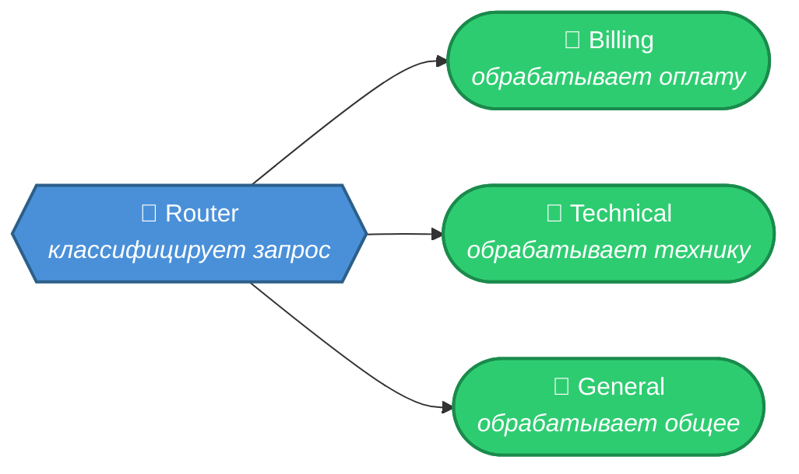

Разница с Supervisor: маршрутизатор принимает **одно решение** и выходит из игры. Supervisor остаётся в цикле, получает результаты и решает, что делать дальше. Router — это «развилка на дороге», Supervisor — «диспетчерская башня».

**Плюсы.** Минимальный оверхед — один дополнительный вызов LLM для маршрутизации. Простая реализация — условное ребро или `Command(goto=...)`. Предсказуемость — каждый запрос проходит ровно два узла: маршрутизатор и специалист.

**Минусы.** Нет возможности скорректировать решение — если маршрутизатор ошибся, запрос уходит не тому специалисту. Нет итеративности — специалист должен справиться с первой попытки.

**Когда использовать.** Системы поддержки клиентов: биллинг, техподдержка, общие вопросы. Классификация и обработка: маршрутизатор определяет тип задачи, специалисты обрабатывают. Любой сценарий с чёткими категориями запросов и специализированными обработчиками.

### Network / Handoffs (сеть)

А что если убрать начальника? В паттерне Network нет центрального контроллера. Каждый агент сам решает, кому передать управление дальше. Технически это реализуется через `Command(goto="имя_агента")` — агент завершает свою работу и явно указывает, кто должен работать следующим.

Типичный сценарий — **triage** (сортировка). Входящий запрос попадает к агенту-маршрутизатору, который передаёт его специалисту. Специалист может обработать запрос сам или передать коллеге, если понимает, что задача не в его компетенции. Цепочка передач продолжается до тех пор, пока кто-то не решит задачу и не направит результат на выход.

**Плюсы.** Нет узкого места — решения распределены. Гибкость — каждый агент может адаптировать маршрутизацию под свою ситуацию. Легко масштабируется — новый агент просто подключается к сети.

**Минусы.** Сложнее отлаживать — путь выполнения непредсказуем. Возможны осцилляции: агент A передаёт B, тот возвращает A, и так по кругу. Нужен `recursion_limit` как страховка.

**Когда использовать.** Сценарии с динамической маршрутизацией, где невозможно заранее предсказать порядок агентов. Системы поддержки клиентов, где запрос может «гулять» между специалистами.

> Полный пример: examples_8_2a_langgraph.py, функция example_handoffs_command()

### Pipeline (конвейер)

Самый простой из всех паттернов. Агенты выстроены в цепочку, каждый обрабатывает результат предыдущего и передаёт следующему. Нет условий, нет ветвлений, нет циклов — чистая последовательность.

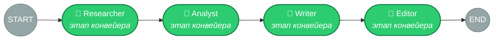

Это по сути тот же конвейер, с которого мы начинали в модуле о LangChain, но теперь каждый «станок» — полноценный агент со своими инструментами, промптом и специализацией. Исследователь может искать в интернете, аналитик — строить графики, редактор — проверять грамматику через внешний API.

**Плюсы.** Максимальная простота. Полностью предсказуемый порядок выполнения. Каждый агент работает в изоляции и не зависит от решений других.

**Минусы.** Никакого параллелизма — каждый агент ждёт предыдущего. Негибкость — если аналитик обнаружил, что данных исследователя недостаточно, он не может попросить его доработать.

**Когда использовать.** Задачи с чётким последовательным процессом. Генерация контента: исследование → черновик → редактура → финализация. Обработка данных: извлечение → очистка → анализ → отчёт.

> Полный пример: examples_8_2_patterns.py, функция example_pipeline()

### Swarm (рой)

Идея Swarm — это децентрализация с общим контекстом. У агентов нет фиксированного порядка и нет диспетчера. Вместо этого есть общая очередь задач (или разделяемое состояние), и каждый агент самостоятельно берёт задачу, которую может выполнить.

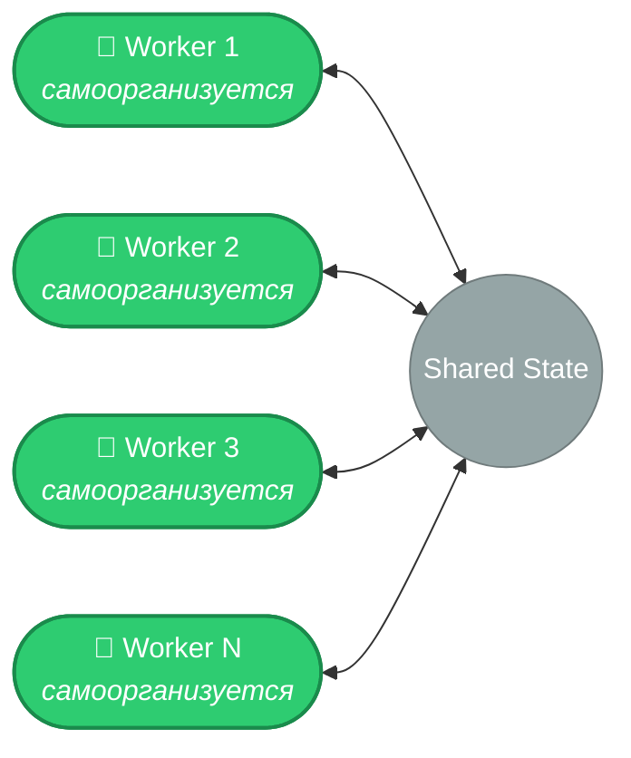

На практике Swarm ближе всего к Network/Handoffs, но с акцентом на равноправие агентов и общий контекст. В LangGraph чистый Swarm реализуется как граф, где все агенты — узлы с `Command(goto=...)`, а общее состояние доступно каждому.

**Плюсы.** Масштабируемость — добавление новых агентов не усложняет координацию. Устойчивость — выход одного агента из строя не блокирует систему. Гибкость — задачи распределяются по компетенции.

**Минусы.** Сложная координация — кто именно возьмёт задачу? Потенциальные конфликты — два агента могут взяться за одно и то же. Трудно отлаживать — путь выполнения зависит от состояния системы в каждый момент.

**Когда использовать.** Системы с большим числом однотипных агентов. Сценарии, где задачи можно обрабатывать независимо. Системы, требующие горизонтального масштабирования.

Swarm — скорее философия, чем строгий архитектурный паттерн. Разница с Network — в ментальной модели: в Network агенты — специалисты с уникальными ролями, в Swarm — взаимозаменяемые участники с общей целью.

### Plan-and-Execute (план и исполнение)

Этот паттерн разделяет мышление и действие на два уровня. **Планировщик** — отдельный агент, который анализирует задачу и создаёт пошаговый план. **Исполнители** — агенты, которые выполняют отдельные шаги плана. После каждого шага происходит **реплан**: планировщик смотрит на результат и корректирует оставшиеся шаги.

В модуле 7 мы видели этот паттерн в контексте одного агента с разными «режимами». Теперь каждый исполнитель — это полноценный агент со своим набором инструментов. Планировщик может назначить шаг «найти данные» агенту-исследователю с доступом к поисковым API, а шаг «построить график» — агенту-аналитику с доступом к Python-интерпретатору.

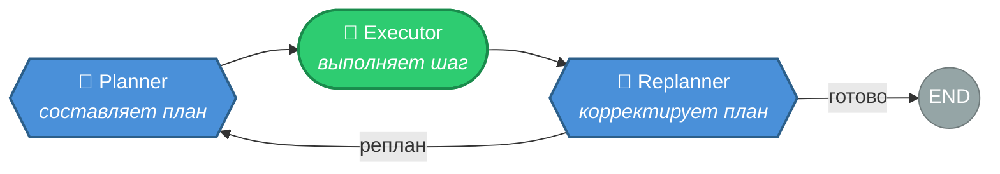

**Плюсы.** Стратегический подход — план виден заранее, его можно проверить перед выполнением. Адаптивность — реплан учитывает результаты предыдущих шагов. Прозрачность — в каждый момент понятно, на каком шаге мы находимся.

**Минусы.** Оверхед на планирование — для простых задач это лишний шаг. Планировщик может создать нереалистичный план. Если реплан не предусмотрен, система следует плану вслепую даже при изменении условий.

**Когда использовать.** Сложные многошаговые задачи: исследования, генерация отчётов, анализ данных. Ситуации, где нужна прозрачность процесса. Задачи, где порядок шагов зависит от результатов предыдущих.

Конкретный сценарий: пользователь просит «подготовь обзор трендов в AI за 2025 год». Планировщик создаёт план: (1) найти ключевые события, (2) проанализировать тренды, (3) написать обзор. Исследователь выполняет шаг 1 и находит, что главный тренд — мультиагентные системы. Перепланировщик видит это и добавляет шаг «найти подробности про мультиагентные фреймворки» перед анализом. Без реплана система бы пропустила эту деталь.

> Полный пример: examples_8_2a_langgraph.py, функция example_plan_execute()

### Dynamic Spawning (динамическое порождение агентов)

Во всех предыдущих паттернах агенты определены заранее: у каждого — фиксированный промпт, фиксированный набор инструментов, фиксированная роль. Dynamic Spawning ломает это ограничение. Здесь **координатор создаёт агентов на лету** — анализирует задачу и генерирует специализированных агентов с кастомными промптами и инструментами под конкретные подзадачи. Отработали — уничтожились.

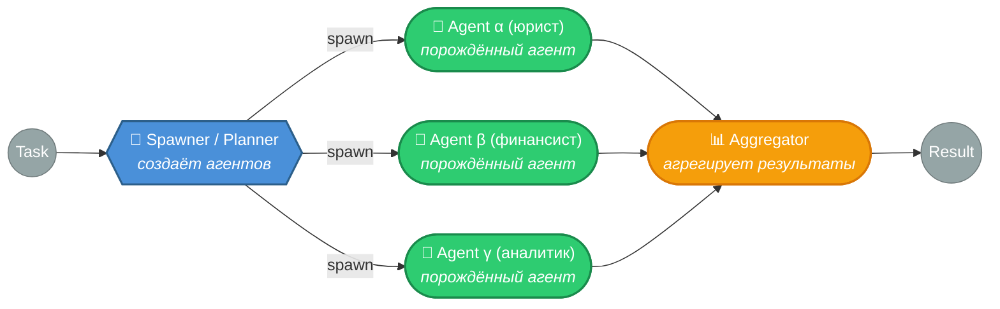

Ключевое отличие от похожих паттернов. В **Map-Reduce** один и тот же агент клонируется на разные данные — промпт одинаковый, входы разные. В **Swarm** агенты предопределены и живут постоянно. В **Dynamic Spawning** каждый агент уникален: его промпт, инструменты и роль конструируются в рантайме исходя из анализа задачи. Количество агентов тоже определяется динамически — не структурой графа, а содержанием запроса.

Конкретный сценарий: пользователь просит «проанализируй контракт на поставку оборудования». Spawner читает контракт, выявляет аспекты — юридические риски, финансовые условия, логистические обязательства — и порождает трёх агентов: юриста (с промптом «ты — юрист, специализируешься на договорном праве» и инструментом доступа к базе прецедентов), финансиста (с промптом «ты — финансовый аналитик» и калькулятором), логиста (с промптом «ты — эксперт по цепочкам поставок» и доступом к базе тарифов). Для другого контракта — скажем, лицензионного соглашения на ПО — Spawner породит совершенно другой набор: юриста по интеллектуальной собственности, аналитика лицензий и специалиста по комплаенсу.

В LangGraph Dynamic Spawning реализуется через `Send()` с динамически формируемым состоянием. Spawner возвращает список `Send`-объектов, в каждом из которых — индивидуальный промпт, набор инструментов и контекст подзадачи. Это тот же механизм, что в Map-Reduce, но каждый `Send` несёт разное «задание на роль».

**Плюсы.** Максимальная адаптивность — система подстраивается под любую задачу, не ограничиваясь предопределённым набором ролей. Экономия — создаются только те агенты, которые нужны. Переиспользуемость — один и тот же Spawner работает с принципиально разными доменами.

**Минусы.** Качество зависит от Spawner'а — если он плохо декомпозирует задачу, порождённые агенты будут бесполезны. Сложнее отлаживать — набор агентов непредсказуем заранее. Дороже Plan-and-Execute — каждый порождённый агент получает уникальный промпт, который нужно сгенерировать. Требует мощной модели для Spawner'а.

**Когда использовать.** Задачи, где набор необходимых компетенций заранее неизвестен и определяется содержанием входных данных. Аналитические платформы, работающие с разными доменами. Системы, которые должны масштабироваться на новые типы задач без изменения кода.

> Полный пример: examples_8_2a_langgraph.py, функция example_dynamic_spawning()

---

## Часть 2: Паттерны коллаборации

### Reflection (критик + исполнитель)

Паттерн Reflection — один из самых мощных способов повышения качества. Два агента работают в цикле: **генератор** создаёт результат, **критик** оценивает и указывает на недостатки. Генератор улучшает результат с учётом критики, критик оценивает снова — и так до тех пор, пока критик не одобрит результат или не будет исчерпан лимит итераций.

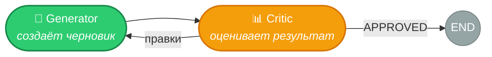

В модуле 7 мы видели рефлексию как внутренний цикл одного агента. Теперь генератор и критик — отдельные агенты с собственными инструментами и экспертизой. Генератор-писатель может использовать поисковые API для фактчекинга. Критик может вызывать инструмент проверки грамматики, считать метрики читаемости, сверяться со стайлгайдом.

Важная деталь реализации: критик должен возвращать структурированный ответ — одобрение (APPROVED) или конкретную критику с указаниями. Условное ребро проверяет наличие «APPROVED» и направляет поток либо обратно к генератору, либо на выход.

**Плюсы.** Итеративное улучшение — каждая итерация повышает качество. Специализация — критик может иметь другую модель или промпт, оптимизированный для оценки. Контролируемость — лимит итераций гарантирует завершение.

**Минусы.** Увеличивает количество вызовов LLM (минимум 2x). Критик может быть слишком строгим и не одобрить результат за заданное число итераций. Может улучшать форму, не затрагивая суть.

**Когда использовать.** Генерация текста, кода, отчётов — всего, что поддаётся объективной оценке. Ситуации, где стоимость ошибки высока и стоит потратить дополнительные вызовы на проверку.

В LangGraph цикл рефлексии реализуется элегантно: условное ребро из узла критика ведёт либо обратно к генератору (если нужны правки), либо на выход (если текст одобрен). Ограничение по итерациям добавляется через счётчик в состоянии — это страховка от бесконечного цикла, когда критик слишком требователен.

> Полный пример: examples_8_2a_langgraph.py, функция example_self_reflection()

### Debate (дебаты)

Паттерн Debate выводит идею рефлексии на новый уровень. Вместо пары «генератор + критик» здесь несколько агентов с **разными позициями** спорят друг с другом. Агент-медиатор выслушивает все стороны и синтезирует итоговый ответ.

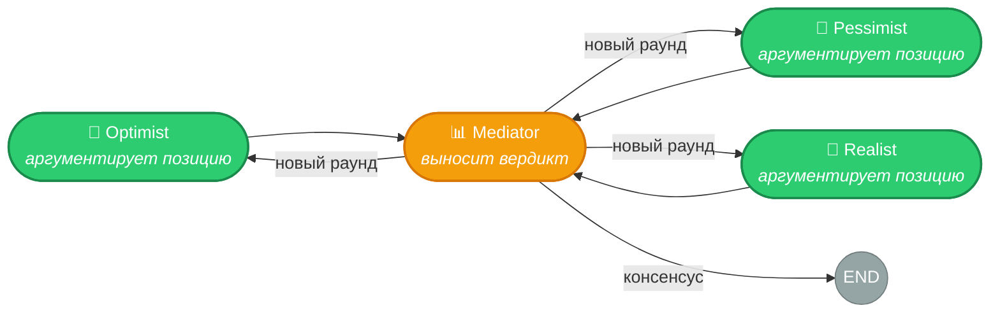

Классический сценарий — анализ решений. Агент-оптимист ищет возможности и преимущества, агент-пессимист — риски и угрозы, агент-реалист — практические ограничения. Медиатор синтезирует сбалансированное заключение, учитывающее все точки зрения.

Дебаты проходят в несколько раундов. В каждом раунде агенты видят аргументы оппонентов и могут на них ответить, уточнить свою позицию или признать сильные аргументы противника. Это создаёт динамику, которая невозможна при простой рефлексии.

**Плюсы.** Многогранный анализ — разные перспективы выявляют аспекты, которые одиночный агент пропустил бы. Снижение предвзятости — позиции балансируют друг друга. Хорошо работает для решений с высокой неопределённостью.

**Минусы.** Дорого — каждый раунд умножает число вызовов LLM на число агентов. Может скатиться в бесплодные споры, если позиции слишком полярны. Медиатор должен быть достаточно умным, чтобы синтезировать противоречия.

**Когда использовать.** Стратегические решения: инвестиции, архитектурный выбор, оценка рисков. Задачи, где важна полнота анализа и учёт разных перспектив.

> Полный пример: examples_8_2_patterns.py, функция example_debate()

### Round-Robin Discussion (обсуждение по кругу)

Если Debate — это спор с фиксированными позициями, то Round-Robin — это совещание, где участники по очереди дополняют общий результат. Каждый агент видит то, что написали предыдущие, и добавляет свою часть: уточняет, расширяет, исправляет.

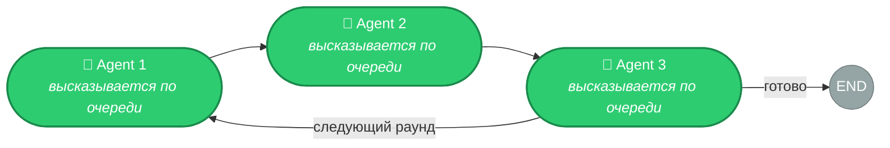

Круг может быть одноразовым (каждый высказался — готово) или многораундовым (несколько проходов, пока результат не стабилизируется). В отличие от Debate, здесь нет противостояния позиций — агенты сотрудничают, а не спорят. В отличие от Pipeline, каждый агент работает над **одним и тем же** артефактом, а не передаёт результат следующему этапу.

Типичный сценарий — совместное написание документа. Первый агент создаёт структуру и тезисы. Второй дополняет фактами и примерами. Третий проверяет логику и связность. Если нужен второй раунд — первый агент обновляет структуру с учётом новых фактов, и так далее.

**Плюсы.** Кумулятивное улучшение — каждый агент строит на работе предыдущих. Простая реализация — цикл по списку агентов. Гибкость — количество раундов настраивается.

**Минусы.** Последовательное выполнение — никакого параллелизма. Поздние агенты видят результаты ранних — возможен эффект якорения. При многих раундах растёт контекстное окно.

**Когда использовать.** Совместная генерация контента, где агенты дополняют друг друга. Итеративное улучшение документа несколькими экспертами. Сценарии, где важен общий контекст между участниками.

### Voting / Consensus (голосование)

Идея проста: N агентов **независимо** решают одну и ту же задачу. Результаты агрегируются голосованием (для категориальных задач) или усреднением (для числовых). Побеждает большинство.

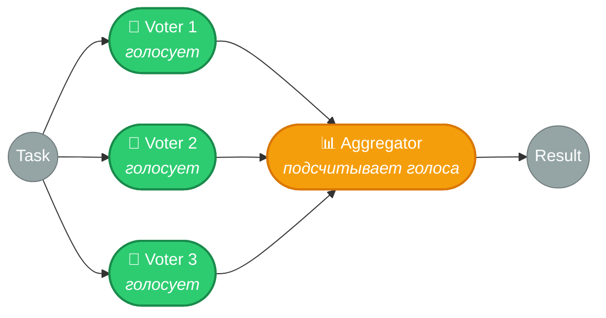

Это статистический подход к повышению надёжности. Один агент может галлюцинировать — вероятность, скажем, 10%. Но вероятность, что два из трёх независимых агентов галлюцинируют одинаково, значительно ниже. Три агента классифицируют тональность текста, и если двое говорят «негативная», а один — «позитивная», мы берём ответ большинства.

Ключевое слово — **независимо**. Агенты не должны видеть ответы друг друга. Иначе возникает эффект якорения: поздний агент подстраивается под раннего, и статистическое преимущество теряется. В LangGraph это реализуется через параллельный запуск с `Send()`.

**Плюсы.** Снижает вероятность ошибки. Простая реализация. Работает для любых задач, где есть дискретный ответ.

**Минусы.** Умножает стоимость на N. Не помогает, если ошибка систематическая (все агенты используют одну модель с одним промптом — и все галлюцинируют одинаково). Для сложных задач агрегация может быть нетривиальной.

**Когда использовать.** Классификация, извлечение сущностей, валидация фактов — задачи с чётким ответом. Ситуации, где стоимость ошибки превышает стоимость дополнительных вызовов.

Практическая рекомендация: для повышения эффективности голосования используйте разные промпты или даже разные модели для каждого агента. Это увеличивает разнообразие ответов и снижает риск систематической ошибки. Три агента с одним промптом и одной моделью — это три копии одного и того же, а не три независимых эксперта.

### Ensemble (ансамбль)

Ensemble — обобщение Voting. Если Voting — это простое большинство голосов, то Ensemble охватывает любые стратегии агрегации результатов нескольких агентов.

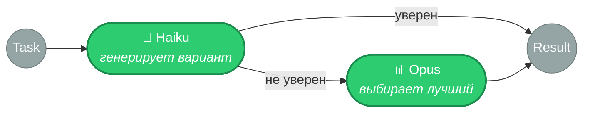

Три типичных стратегии. **Взвешенное голосование** — агентам присваиваются веса на основе их прошлой точности. Агент, который чаще ошибается, получает меньший вес. **Стэкинг** — результаты нескольких агентов передаются мета-агенту, который обучен (или проинструктирован промптом) комбинировать их оптимально. **Каскад** — сначала работает быстрый и дешёвый агент; если его уверенность ниже порога, подключается более мощный (и дорогой). Это экономит ресурсы: большинство простых запросов обрабатывается дёшево, а тяжёлая артиллерия вызывается только когда нужна.

Каскад особенно популярен на практике. Первая линия — быстрая модель (Haiku), которая справляется с 80% запросов. Вторая линия — мощная модель (Sonnet/Opus) для оставшихся 20%. Суммарная стоимость значительно ниже, чем если бы все запросы шли через дорогую модель.

**Когда использовать.** Когда простого голосования недостаточно и нужна более тонкая агрегация. Когда агенты имеют разные сильные стороны и нужно учитывать это при объединении результатов. Когда важна оптимизация стоимости при сохранении качества (каскад).

### Map-Reduce (параллельная обработка)

Map-Reduce — это «разделяй и властвуй» для агентов. Задача разбивается на N подзадач (fan-out), каждая обрабатывается отдельным экземпляром агента параллельно, результаты собираются в один (fan-in).

Мы видели `Send()` в модуле 7 — теперь каждый узел, получающий Send, является полноценным агентом. Например: проанализировать 10 документов. Маппер создаёт 10 параллельных задач через `Send()`, каждая достаётся агенту-аналитику. Редьюсер собирает 10 анализов и синтезирует общий отчёт.

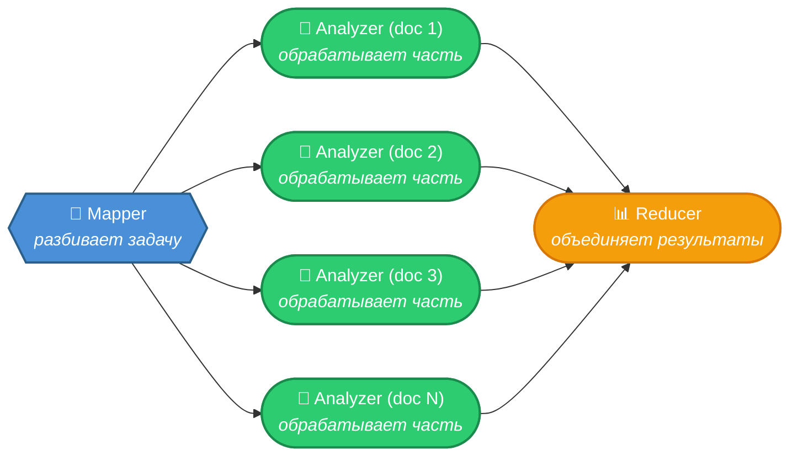

**Плюсы.** Параллелизм — 10 документов анализируются одновременно, а не последовательно. Масштабируемость — N не ограничено архитектурой. Простая модель — каждый агент работает изолированно.

**Минусы.** Стоимость — N параллельных вызовов LLM. Подзадачи должны быть независимыми. Агрегация (reduce) может быть нетривиальной и потерять нюансы отдельных результатов.

**Когда использовать.** Обработка коллекций: анализ документов, резюме статей, извлечение данных из набора файлов. Любая задача, которая естественно декомпозируется на независимые части.

> Полный пример: examples_8_2a_langgraph.py, функция example_map_reduce_agents()

---

## Часть 3: Матрица выбора

Как выбрать паттерн? Вот дерево решений.

| Задача                                          | Паттерн                              |
| ----------------------------------------------- | ------------------------------------ |
| Один агент с инструментами справляется          | Не нужна мультиагентность (модуль 7) |
| Чёткая последовательность специалистов          | **Pipeline**                         |
| Нужна центральная координация                   | **Supervisor**                       |
| Много агентов, нужна иерархия                   | **Hierarchical Supervisor**          |
| Одноразовая маршрутизация по категориям         | **Router / Triage**                  |
| Агенты должны сами решать, кому передать        | **Network / Handoffs**               |
| Сложная задача с неизвестным заранее планом     | **Plan-and-Execute**                 |
| Набор компетенций определяется входными данными | **Dynamic Spawning**                 |
| Нужно итеративно улучшить результат             | **Reflection**                       |
| Нужен анализ с разных позиций                   | **Debate**                           |
| Совместное дополнение одного артефакта          | **Round-Robin Discussion**           |
| Снижение риска ошибки/галлюцинации              | **Voting**                           |
| Тонкая агрегация или каскад дешёвый→дорогой     | **Ensemble**                         |
| Параллельная обработка коллекции                | **Map-Reduce**                       |
| Много однотипных агентов, динамические задачи   | **Swarm**                            |

Практическое правило: начните с самого простого паттерна, который решает задачу (чеклист «когда нужна MAS» мы разобрали в лекции 1). Если Pipeline достаточно — не нужен Supervisor.

Паттерн часто определяется не задачей, а требованиями к качеству и скорости. Один и тот же запрос «напиши отчёт» можно обработать Pipeline (быстро, дёшево, приемлемое качество), Pipeline + Reflection (медленнее, дороже, выше качество) или Supervisor + Debate + Reflection (долго, дорого, максимальное качество). Выбор зависит от контекста: черновик для внутреннего обсуждения или финальный документ для клиента.

---

## Итоги

Мы разобрали четырнадцать паттернов мультиагентных систем.

**Восемь паттернов оркестрации** определяют структуру координации:

- **Supervisor** — центральный диспетчер с LLM-маршрутизацией
- **Hierarchical Supervisor** — дерево супервайзеров для больших систем (10+ агентов)
- **Router / Triage** — одноразовая маршрутизация к нужному специалисту
- **Network/Handoffs** — децентрализованная сеть с передачей управления через `Command(goto=...)`
- **Pipeline** — последовательный конвейер агентов-специалистов
- **Swarm** — рой взаимозаменяемых агентов с общим контекстом
- **Plan-and-Execute** — планировщик создаёт план, исполнители выполняют шаги, перепланировщик корректирует
- **Dynamic Spawning** — координатор порождает специализированных агентов на лету под конкретные подзадачи

**Шесть паттернов коллаборации** определяют способ совместного повышения качества:

- **Reflection** — генератор + критик в цикле итеративного улучшения
- **Debate** — агенты с разными позициями спорят, медиатор синтезирует
- **Round-Robin Discussion** — агенты по очереди дополняют общий результат
- **Voting** — N агентов независимо решают задачу, результат — по большинству
- **Ensemble** — обобщение Voting: взвешенное голосование, стэкинг, каскад
- **Map-Reduce** — параллельная обработка через `Send()` с агрегацией результатов

На практике паттерны редко используются в чистом виде — они комбинируются друг с другом, создавая системы произвольной сложности. Комбинированию паттернов посвящена следующая лекция.