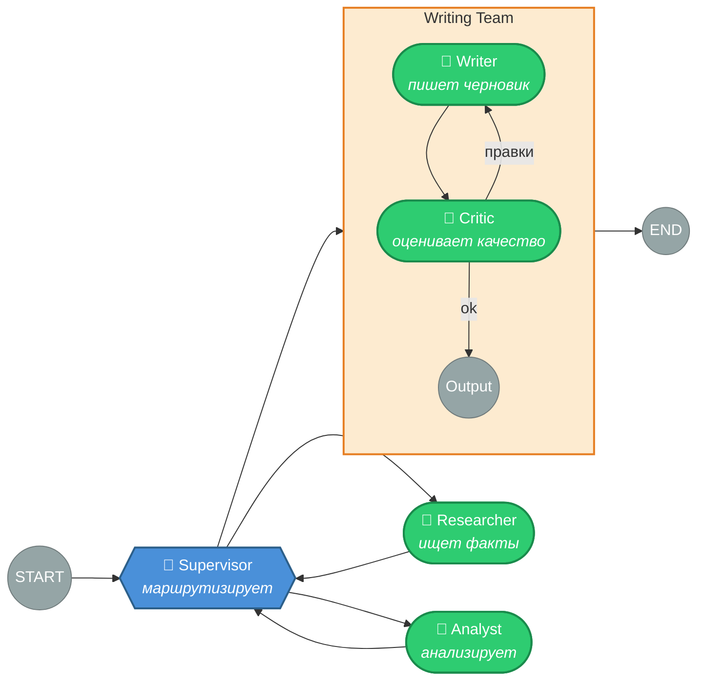
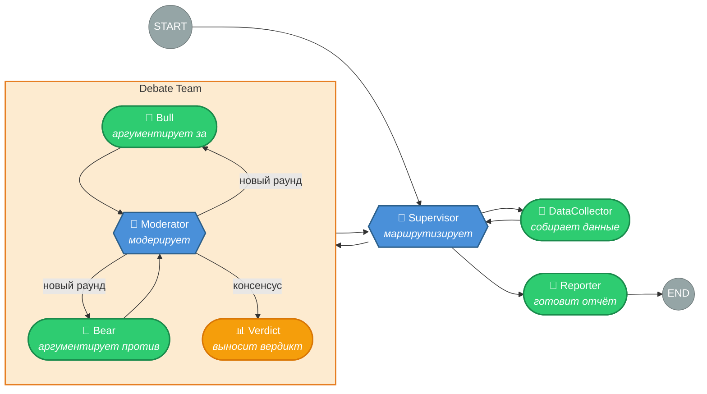
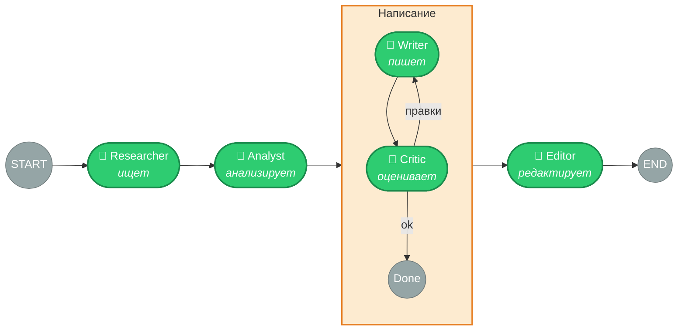
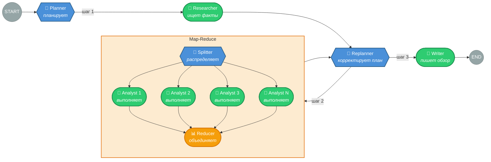
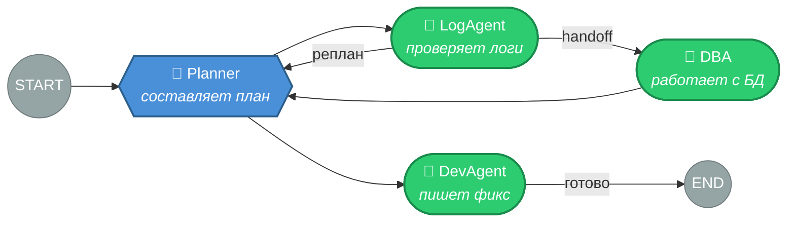
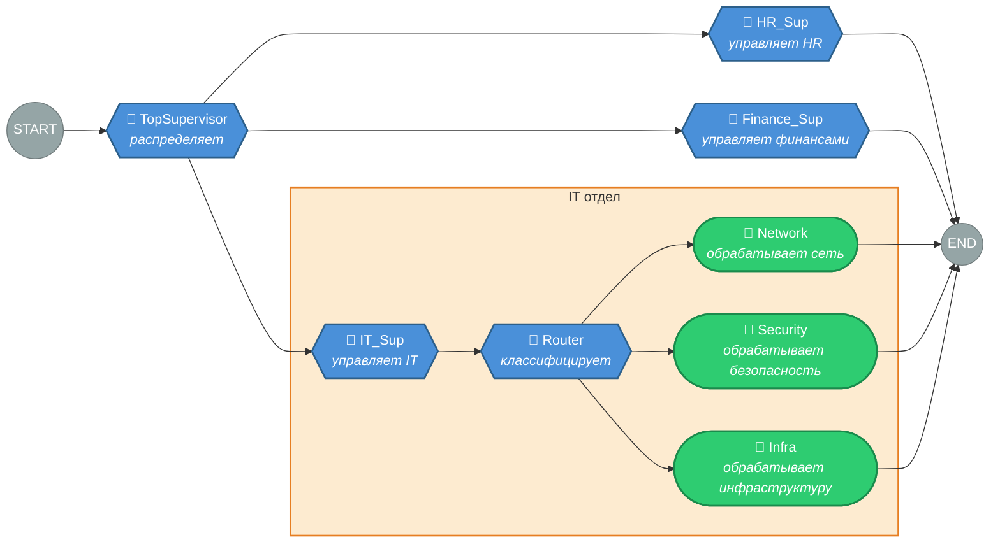

# Лекция 3: Комбинирование паттернов

## Введение

В предыдущей лекции мы разобрали четырнадцать паттернов мультиагентных систем — восемь оркестрации и шесть коллаборации. Каждый паттерн решает конкретную задачу координации. Но на практике паттерны редко используются в чистом виде. Реальная система — это почти всегда комбинация нескольких паттернов, где каждый отвечает за свой уровень архитектуры.

Почему так? Потому что паттерны оркестрации и коллаборации **ортогональны**. Оркестрация отвечает на вопрос «кто работает следующим» — это скелет системы. Коллаборация отвечает на вопрос «как агенты повышают качество» — это мышцы. Скелет без мышц — неподвижная конструкция. Мышцы без скелета — бесформенная масса. Нужно и то, и другое.

В этой лекции мы разберём конкретные комбинации, от простых до сложных, посмотрим, как они реализуются в LangGraph, и выведем принципы проектирования комбинированных систем.

---

## Часть 1: Оркестрация + Коллаборация

### Supervisor + Reflection

Самая частая комбинация. Супервайзер управляет командой агентов, но один из «агентов» — это на самом деле не одиночный узел, а пара генератор–критик, работающая в цикле рефлексии.

Конкретный сценарий: система генерации отчётов. Супервайзер координирует исследователя, аналитика и писателя. Писатель — не просто узел, а подграф из двух агентов: автор пишет черновик, редактор проверяет, автор исправляет, редактор проверяет снова. Супервайзер не знает об этом внутреннем цикле — он отправляет задачу «написать текст» и получает отполированный результат.

**Реализация в LangGraph.** Подграф рефлексии компилируется отдельно и встраивается как узел в граф супервайзера. Это тот самый механизм subgraphs из модуля 7: `parent_graph.add_node("writing_team", compiled_reflection_graph)`. Супервайзер вызывает этот узел как любой другой — внутренняя сложность скрыта.

**Когда использовать.** Когда часть задач требует итеративного улучшения, а часть — нет. Исследователь выдаёт факты с первого раза, но текст нужно шлифовать. Нет смысла оборачивать всех агентов в рефлексию — только тех, где качество критично.

### Supervisor + Debate

Перед принятием важного решения супервайзер запускает не одного агента, а дебаты. Два-три агента с разными позициями спорят, медиатор синтезирует сбалансированное заключение. Супервайзер получает это заключение и принимает решение на его основе.

Конкретный сценарий: инвестиционный анализ. Супервайзер координирует сбор данных, анализ и рекомендацию. На этапе анализа вместо одного аналитика запускаются дебаты: агент-бык (рост, возможности), агент-медведь (риски, падение), медиатор. Супервайзер получает взвешенную оценку, а не однобокий прогноз.

**Когда использовать.** Решения с высокой ценой ошибки: инвестиции, архитектурный выбор, медицинские рекомендации. Дебаты дороги, поэтому супервайзер запускает их только для критических этапов, а рутинные задачи отдаёт обычным агентам.

### Pipeline + Voting

Конвейер, где каждый этап продублирован для надёжности. Вместо одного исследователя — три, работающих независимо. Результаты агрегируются голосованием, и только консенсусный результат передаётся следующему этапу.

Конкретный сценарий: обработка юридических документов. Три агента-экстрактора независимо извлекают ключевые пункты из договора. Если двое из трёх согласны — факт принят. Далее три аналитика независимо оценивают риски. Снова голосование. Стоимость выше в 3 раза, но для юридических документов цена ошибки несопоставимо больше.

```mermaid
graph LR
    START((START)) --> Extract
    subgraph Extract[Извлечение]
        E1(["🔹 Extractor 1<br/><i>извлекает данные</i>"]) & E2(["🔹 Extractor 2<br/><i>извлекает данные</i>"]) & E3(["🔹 Extractor 3<br/><i>извлекает данные</i>"])
    end
    subgraph Analyze[Анализ]
        A1(["🔹 Analyst 1<br/><i>анализирует</i>"]) & A2(["🔹 Analyst 2<br/><i>анализирует</i>"]) & A3(["🔹 Analyst 3<br/><i>анализирует</i>"])
    end
    Extract --> Vote1(["📊 Vote 1<br/><i>подсчёт голосов</i>"]) --> Analyze --> Vote2(["📊 Vote 2<br/><i>подсчёт голосов</i>"]) --> Result((END))

    classDef worker fill:#2ECC71,stroke:#1A8B4C,color:#fff,stroke-width:2px
    classDef aggregator fill:#F59E0B,stroke:#D97706,color:#fff,stroke-width:2px
    classDef terminal fill:#95A5A6,stroke:#707B7C,color:#fff

    class E1,E2,E3,A1,A2,A3 worker
    class Vote1,Vote2 aggregator
    class START,Result terminal

    style Extract fill:#FDEBD0,stroke:#E67E22,stroke-width:2px,color:#333
    style Analyze fill:#FDEBD0,stroke:#E67E22,stroke-width:2px,color:#333
```

**Когда использовать.** Задачи, где стоимость ошибки на порядки превышает стоимость дополнительных вызовов. Юридические, медицинские, финансовые документы. Регуляторные отчёты.

### Pipeline + Reflection

Более экономный вариант повышения качества в конвейере. Вместо дублирования каждого этапа (Voting) добавляем цикл рефлексии на критических этапах. Исследователь работает без рефлексии — факты либо найдены, либо нет. А писатель работает в паре с критиком, шлифуя текст до нужного уровня.

**Когда использовать.** Когда Pipeline даёт приемлемое качество на большинстве этапов, но один-два этапа требуют доработки. Это дешевле, чем Pipeline + Voting, и точечнее — рефлексия только там, где нужна.

---

## Часть 2: Оркестрация + Оркестрация

### Plan-Execute + Map-Reduce

Два паттерна оркестрации на разных уровнях. Планировщик создаёт стратегический план. Один из шагов плана — массовая обработка данных. Исполнитель этого шага запускает Map-Reduce: параллельный fan-out к агентам-анализаторам, затем агрегация.

Конкретный сценарий: подготовка обзора рынка. Планировщик: (1) определить ключевых игроков, (2) проанализировать каждого, (3) написать сравнительный обзор. Шаг 2 — это Map-Reduce: 10 компаний анализируются параллельно десятью экземплярами агента-аналитика. Редьюсер собирает 10 анализов в сводную таблицу. Планировщик получает таблицу и планирует шаг 3.

**Когда использовать.** Сложные задачи, где один из шагов — обработка коллекции. Исследования с анализом множества источников. Сравнительные обзоры. Аудиты.

### Network + Plan-Execute

Агент-планировщик создаёт план и передаёт первый шаг исполнителю через `Command(goto=...)`. Исполнитель, завершив шаг, может либо вернуть управление планировщику для реплана, либо передать следующему исполнителю напрямую, если контекст подсказывает, что следующий шаг — в его компетенции.

Конкретный сценарий: техподдержка сложных инцидентов. Планировщик анализирует тикет и создаёт план: (1) проверить логи, (2) воспроизвести баг, (3) написать фикс. Агент-логист проверяет логи и видит, что проблема в базе данных. Вместо возврата к планировщику он передаёт задачу напрямую DBA-агенту — это быстрее и контекст не теряется. DBA-агент решает проблему и возвращает результат планировщику для реплана.

**Когда использовать.** Системы, где план нужен для стратегии, но тактические решения лучше принимать на месте. Техподдержка, инцидент-менеджмент, сложные workflows с непредсказуемыми ветвлениями.

### Hierarchical Supervisor + Router

Верхний уровень — иерархический супервайзер, который распределяет задачи между отделами. Внутри одного из отделов — Router, который одноразово маршрутизирует запрос к нужному специалисту.

Конкретный сценарий: корпоративный AI-ассистент. Верхний супервайзер определяет домен: HR, IT, Finance. IT-супервайзер получает запрос и передаёт роутеру, который направляет к специалисту: сеть, безопасность, инфраструктура. Специалист решает задачу без возврата — это одноразовая маршрутизация внутри иерархии.

**Когда использовать.** Большие системы с десятками агентов. Корпоративные ассистенты. Платформы поддержки с несколькими уровнями специализации.

---

## Часть 3: Коллаборация + Коллаборация

### Debate + Voting

Дебаты для генерации разнообразных аргументов, голосование для выбора итогового решения. Несколько команд дебатирующих агентов независимо приходят к своим заключениям. Затем эти заключения агрегируются голосованием.

Конкретный сценарий: оценка стартапа для инвестирования. Три независимых команды по три агента (оптимист, пессимист, реалист) анализируют стартап. Каждая команда выдаёт рекомендацию (invest / pass / conditional). Голосование по трём рекомендациям определяет итоговое решение. Это снижает и предвзятость (дебаты), и случайность (голосование).

**Когда использовать.** Решения с максимальной ценой ошибки, где оправданы затраты на 9+ вызовов LLM. Инвестиционные решения, медицинские консилиумы.

### Reflection + Ensemble

Несколько генераторов создают варианты решения. Каждый вариант проходит через свой цикл рефлексии. Затем мета-агент (ансамбль) выбирает лучший из отполированных вариантов или синтезирует из них финальный результат.

Конкретный сценарий: генерация маркетингового текста. Три автора с разными стилями (формальный, разговорный, провокационный) пишут вариант. Каждый проходит через своего критика — 2-3 итерации. Мета-агент получает три отшлифованных варианта и выбирает лучший или комбинирует сильные стороны каждого.

**Когда использовать.** Творческие задачи, где разнообразие подходов ценнее одного «правильного» ответа. Генерация контента, дизайн, нейминг.

---

## Часть 4: Принципы комбинирования

Комбинации можно строить бесконечно, но не все из них полезны. Вот принципы, которые помогают не перемудрить.

### Принцип матрёшки

Внутренний паттерн скрыт за интерфейсом внешнего. Супервайзер не знает, что внутри «писателя» крутится рефлексия. Планировщик не знает, что шаг «анализ» — это Map-Reduce из десяти агентов. Каждый уровень видит только свой интерфейс: вход и выход. В LangGraph это реализуется через подграфы — скомпилированный подграф встраивается как обычный узел.

### Принцип точечного усиления

Не нужно усиливать каждый этап. Рефлексия на этапе исследования — лишняя трата: факты либо найдены, либо нет. Голосование на этапе форматирования — бессмысленно. Усиливайте только те этапы, где (а) качество критично и (б) итеративное улучшение или параллельная проверка реально помогают.

### Принцип бюджета

Каждая комбинация умножает стоимость. Supervisor + Reflection — это 2-3x к стоимости каждой задачи, отправленной в рефлексию. Pipeline + Voting — 3x на каждый этап. Debate + Voting — 9x на этап анализа. Бюджет токенов — это реальное ограничение. Комбинируйте обдуманно: простой Pipeline для черновиков, Pipeline + Reflection для финальных документов, Pipeline + Voting + Debate только для решений, где ошибка стоит дороже, чем десятикратный бюджет на токены.

### Матрица стоимости

| Комбинация | Множитель стоимости | Множитель качества |
| ---------- | ------------------- | ------------------ |
| Чистый Pipeline | 1× | базовое |
| Pipeline + Reflection (на 1 этапе) | ~2× | выше на этапе рефлексии |
| Supervisor + Reflection | ~2-3× | выше для задач с рефлексией |
| Pipeline + Voting (3 агента) | 3× | значительно выше |
| Supervisor + Debate | ~4-6× | многогранный анализ |
| Debate + Voting (3 команды) | ~9× | максимальное |

Эти множители — грубые оценки. Реальная стоимость зависит от числа итераций рефлексии, раундов дебатов и размера контекста.

---

## Итоги

Комбинирование паттернов — это инженерное проектирование, а не магия. Три принципа помогают не заблудиться.

**Матрёшка** — внутренний паттерн скрыт за интерфейсом внешнего. Подграфы в LangGraph реализуют это естественно.

**Точечное усиление** — усиливайте только критические этапы, а не всё подряд.

**Бюджет** — каждая комбинация умножает стоимость. Выбирайте уровень качества, который оправдан задачей.

Типичный путь: начните с простого Pipeline. Добавьте Reflection на этапе, где качество проседает. Если нужна надёжность — Voting на критических этапах. Если нужна стратегия — замените Pipeline на Supervisor или Plan-Execute. Усложняйте только когда простое решение не справляется.

В следующей лекции мы реализуем паттерны и их комбинации в коде LangGraph — с реальными вызовами LLM, графами состояний и конкретными сценариями.