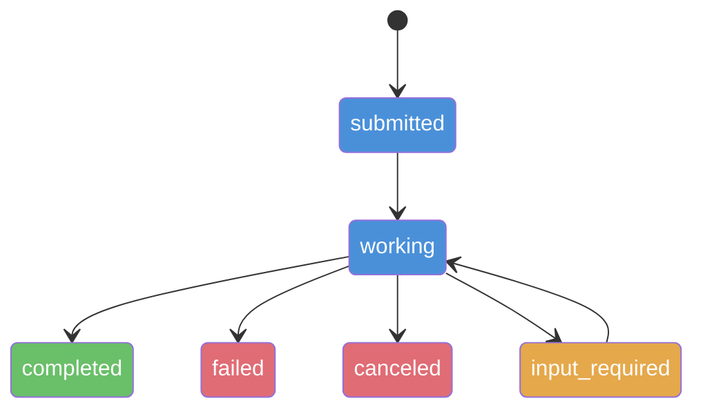
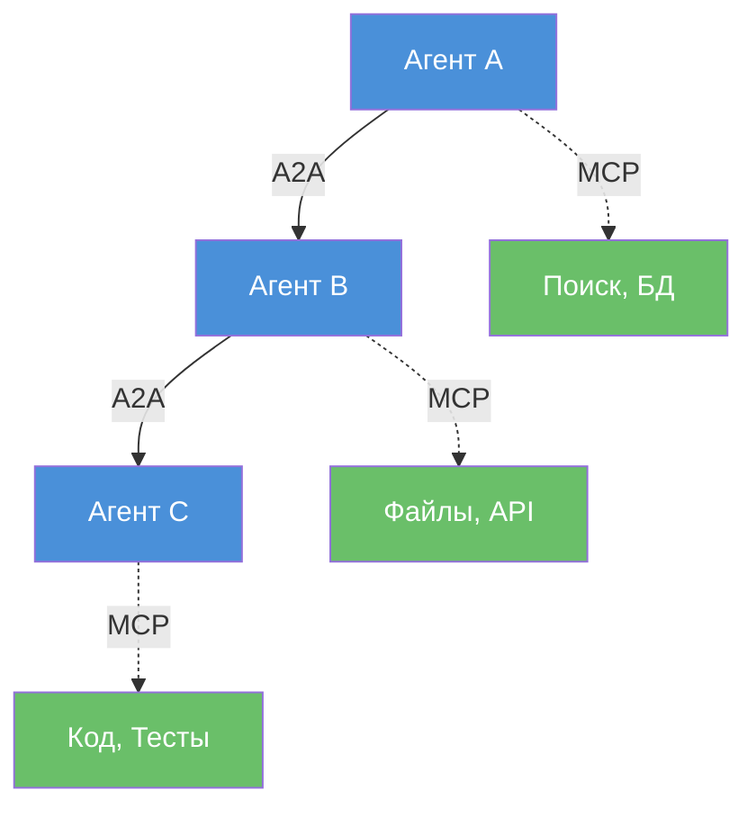

# Лекция 4: Протоколы межагентной коммуникации — MCP и A2A

## Введение: Когда общее состояние перестаёт работать

В предыдущих лекциях все наши мультиагентные системы жили внутри одного графа LangGraph. Исследователь пишет в поле `research`, писатель читает его и пишет в `draft`, редактор читает `draft` и возвращает замечания. Агенты общаются через разделяемое состояние — один `TypedDict`, один процесс, одна машина.

Это работает. Но у этого подхода есть потолок — и он наступает быстрее, чем кажется.

Представьте: ваша компания построила агента-аналитика, который умеет анализировать финансовые отчёты. Партнёрская компания построила агента-исследователя, который умеет собирать рыночные данные. Вы хотите, чтобы ваш аналитик мог попросить их исследователя найти данные. Как они будут общаться? Через общий `TypedDict`? Через один граф LangGraph? Очевидно, нет. Это разные кодовые базы, разные инфраструктуры, возможно — разные языки программирования. Нужен протокол — стандартный способ общения, который работает через границы процессов, машин и организаций.

В 2024–2026 годах индустрия выработала два ключевых протокола, которые вместе покрывают основные сценарии взаимодействия: **MCP** для доступа к инструментам и **A2A** для коммуникации между агентами. В этой лекции мы разберём оба протокола — с архитектурой, кодом и пониманием того, как они дополняют друг друга в мультиагентном контексте.

---

## Часть 1: MCP в мультиагентном контексте

### Напоминание: что такое MCP

MCP (Model Context Protocol) мы подробно разбирали в модуле 4. Напомним ключевое: MCP стандартизирует взаимодействие агента с внешним миром — инструментами, базами данных, файловыми системами, API. Архитектура трёхуровневая: Host (приложение) → Client (коннектор) → Server (провайдер инструментов). Три типа capabilities: Tools (вызовы функций), Resources (данные для чтения), Prompts (шаблоны).

Аналогия, которую мы использовали тогда: MCP — это **USB-порт** для агентов. Как USB стандартизировал подключение периферии к компьютеру, MCP стандартизирует подключение инструментов к агенту. Клавиатура, мышь, внешний диск — всё через один разъём. Поисковый API, база данных, файловая система — всё через один протокол.

На начало 2026 MCP — это зрелый стандарт: спецификация 2025-11-25 (следующая ожидается к июню 2026), более 10 000 опубликованных серверов, 97 миллионов SDK-скачиваний в месяц. Клиенты: ChatGPT, Claude, Cursor, Gemini, Microsoft Copilot, VS Code, Windsurf, Perplexity. Windows 11 анонсировала нативную поддержку MCP. Это не экспериментальная технология — это инфраструктура.

Но в контексте мультиагентных систем MCP приобретает новые свойства, которые мы не обсуждали в модуле 4.

### Каждый агент — свой набор инструментов

В одноагентной системе вопрос «какие инструменты подключить» решается один раз. Но в MAS каждый агент может — и должен — подключаться к своему набору MCP-серверов. Исследователь работает через MCP-сервер поискового API. Аналитик — через MCP-сервер с доступом к базе данных. Редактор — через MCP-сервер проверки грамматики.

Это создаёт архитектуру, где **инструменты изолированы по агентам**. Исследователь не имеет доступа к базе данных — не потому что мы забыли подключить, а по принципу least privilege: каждый агент получает только те инструменты, которые нужны для его задачи. Это и безопасность (агент не может случайно или намеренно испортить данные в чужой системе), и quality (модель не путается в выборе из 30 инструментов, когда ей доступны только 3 релевантных).

Замена одного MCP-сервера на другой (например, переход с Tavily на Perplexity для поиска) не требует изменений в самом агенте — достаточно переключить конфигурацию. Агент знает: «у меня есть инструмент search». Какой именно сервер стоит за этим инструментом — деталь реализации, скрытая за протоколом.

В LangChain интеграция с MCP идёт через пакет `langchain-mcp-adapters` (версия 0.2.2 на март 2026). `MultiServerMCPClient` позволяет подключить несколько MCP-серверов одновременно и раздать инструменты по агентам. При этом имена инструментов автоматически получают **префиксы** по имени сервера — `search_web`, `database_query` — чтобы одноимённые инструменты от разных серверов не конфликтовали. Это как пространства имён в программировании: однозначно и без сюрпризов.

Помимо базовой функциональности, адаптер поддерживает мультимодальные инструменты (работа с изображениями, аудио), elicitation (MCP-сервер может запросить дополнительную информацию у пользователя через агента) и структурированный вывод результатов как артефактов.

> Полный пример подключения нескольких MCP-серверов: examples_04_protocols.ipynb, часть 1

### Агент внутри инструмента

Самое интересное свойство MCP в мультиагентном контексте — **вложенность**. MCP-сервер может быть обёрткой вокруг другого агента. Или даже вокруг целой мультиагентной системы.

Представьте MCP-сервер «глубокий анализ». Для вызывающего агента это один инструмент: `deep_analysis(query) -> report`. Отправь запрос, получи результат. Просто. Но внутри этого сервера работает целая система — поисковый агент находит источники, аналитик обрабатывает данные, писатель формирует отчёт. Мультиагентная система внутри инструмента внутри другой мультиагентной системы. Матрёшка.

Реализация элегантна: MCP-сервер объявляет `@server.tool()`, а внутри вызывает `await analysis_graph.ainvoke(...)`. Для внешнего мира — один инструмент. Внутри — полный граф LangGraph.

Это создаёт возможность для **иерархической композиции**. Вместо монолитного графа с двадцатью узлами вы строите несколько компактных MAS, каждая из которых доступна как MCP-сервер. Верхний уровень оркестрирует серверы, не зная (и не заботясь) о том, что происходит внутри каждого. Это те же принципы модульности и инкапсуляции, что и в обычном программировании — только на уровне агентных систем.

Практический бонус: каждый MCP-сервер можно развивать, тестировать и деплоить независимо. Команда A отвечает за сервер анализа, команда B — за сервер генерации, команда C — за оркестратор. Каждая команда меняет свою реализацию, не ломая остальные — пока интерфейс (MCP-протокол) остаётся неизменным.

### Границы MCP

При всей мощности MCP не решает одну принципиальную задачу: **равноправное взаимодействие** между агентами.

MCP — это всегда отношение «клиент вызывает сервер». Клиент знает, какой инструмент ему нужен, вызывает его и получает результат. Это запрос-ответ, синхронная операция, вертикальная интеграция. Как вызов функции в коде: `result = tool(args)`.

Но что если два агента должны обмениваться задачами как равные? Агент-менеджер просит агента-исследователя провести анализ. Тот начинает работать — и это занимает не миллисекунды, а минуты или часы. По ходу работы он возвращает промежуточные статусы: «нашёл 50 документов, анализирую», «обработал 30 из 50», «возник вопрос — какой период данных рассматривать?». Наконец возвращает результат — или сообщает, что не справился.

Это не «вызов функции». Это **делегирование задачи** с отслеживанием прогресса, двусторонним диалогом и возможностью отмены. Для этого нужен другой протокол.

> Полный пример: examples_04_protocols.ipynb, часть 1

---

## Часть 2: A2A — горизонтальная коммуникация между агентами

### Зачем нужен отдельный протокол

Когда агенту нужно обратиться к другому агенту не как к инструменту, а как к коллеге, возникают три требования, которые MCP не покрывает.

**Обнаружение.** Как найти нужного агента, если вы не знаете его заранее? В MCP серверы прописываются в конфигурации. Но в экосистеме из сотен агентов — внутри компании или между организациями — нужен механизм поиска: «мне нужен агент, который умеет анализировать юридические документы на русском языке».

**Длительные задачи.** Вызов MCP-инструмента рассчитан на секунды — максимум десятки секунд. А если агент-исследователь будет работать десять минут, анализируя сотни документов? Нужны статусы, промежуточные результаты, возможность отмены.

**Двусторонний диалог.** Иногда агент-исполнитель не может завершить задачу без уточнения. Ему нужно спросить заказчика: «Ты имел в виду финансовые отчёты за 2025 или 2026 год?». А может и не один раз: «Нашёл данные за оба года, какой формат отчёта предпочтителен?». MCP так не умеет — это всегда однократный запрос-ответ.

A2A (Agent-to-Agent Protocol) решает все три задачи. Если MCP — это USB-порт для подключения инструментов, то A2A — это **телефонная связь** между агентами: можно позвонить, поговорить, задать вопросы, получить ответ, перезвонить позже.

### История и управление

A2A создан Google в апреле 2025 года. Протокол быстро набрал поддержку индустрии и к марту 2026 достиг версии **1.0** — первый стабильный релиз. A2A передан в **Agentic AI Foundation** (AAIF) при Linux Foundation, где им управляет технический совет из AWS, Cisco, Google, IBM Research, Microsoft, Salesforce, SAP и ServiceNow. Протокол поддерживают более 150 организаций.

Это важный факт для архитектурных решений: A2A — не проприетарный протокол одного вендора, а открытый стандарт под управлением фонда. Ваша система на A2A не привяжется к Google, как Swarm привязывался к OpenAI.

### Agent Card — визитная карточка агента

Центральная концепция A2A — **Agent Card**. Представьте LinkedIn-профиль, но для агентов. Это JSON-документ, который агент публикует по стандартному пути `/.well-known/agent.json` — по аналогии с `robots.txt` для поисковых роботов или `/.well-known/openid-configuration` для OAuth.

Любой клиент может обратиться по этому адресу и узнать всё необходимое: кто этот агент, что он умеет, как с ним общаться, как аутентифицироваться.

Agent Card содержит несколько ключевых секций. `**skills`** — описания возможностей агента на естественном языке: название, описание, теги и примеры запросов. В отличие от MCP-инструментов (жёсткая JSON-схема параметров), навыки A2A — семантические: клиент читает описание и примеры, чтобы понять, подходит ли агент для задачи. `**capabilities`** — технические возможности: поддерживает ли агент стриминг, push-уведомления, историю переходов. `**securitySchemes**` — механизмы аутентификации (OAuth, API Key, mTLS и другие).

> Полный пример Agent Card: examples_04_protocols.ipynb, часть 2

В версии 1.0 добавлены **цифровые подписи** карточек. Это защита от подделки: клиент может криптографически убедиться, что карточка действительно принадлежит заявленному агенту, а не подставлена посредником.

### Жизненный цикл задачи

Взаимодействие в A2A строится вокруг **задач** (tasks). Это ключевое отличие от MCP: вместо «вызвать функцию и получить результат» — «создать задачу, отслеживать её выполнение, получить результат».

Клиентский агент создаёт задачу, отправляя её серверному агенту. Задача проходит через состояния:

**submitted** — задача принята, ждёт начала обработки. **working** — агент работает. **input-required** — агент остановился и ждёт уточнения от клиента. Это промежуточное состояние, из которого задача возвращается в working после получения ответа. **completed** — результат готов. **failed** — агент не смог выполнить задачу. **canceled** — клиент отменил задачу.

Состояние `input-required` — одно из главных отличий A2A от MCP. Агент-исполнитель может остановиться в любой момент и спросить: «Мне нужна дополнительная информация». Это делает A2A подходящим для сложных задач, где контекст проясняется по ходу выполнения.

Клиент отслеживает статус тремя способами:

- **Polling** — периодический запрос `GET /tasks/{id}`. Простейший способ, подходит для задач длительностью в минуты.
- **Server-Sent Events (SSE)** — серверный push. Клиент подключается один раз, сервер отправляет обновления по мере появления. Подходит для отображения прогресса в реальном времени.
- **Webhook** — сервер вызывает URL клиента при изменении статуса. Подходит для серверных систем, где клиент не держит открытое соединение.

Результат задачи оформляется как **артефакт** — структурированный объект с типом контента и данными. Задача может производить несколько артефактов по мере выполнения: промежуточный отчёт, финальный отчёт, приложения с графиками. Каждый артефакт — это пара `(content_type, data)`, например `("application/pdf", <binary>)` или `("application/json", {"summary": "...", "metrics": [...]})`.

> Полный пример: examples_04_protocols.ipynb, часть 2

### Три протокольных биндинга

В версии 1.0 A2A поддерживает три равноправных способа транспорта — и выбор между ними зависит от вашей инфраструктуры, а не от функциональности:

**JSON-RPC 2.0** — основной биндинг для веб-интеграций. Запросы и ответы в JSON через HTTP. Самый простой для реализации и отладки. Достаточный для большинства сценариев. Если вы сомневаетесь — начните с JSON-RPC.

**gRPC** — бинарный протокол с потоковой передачей и низкой латентностью. Для систем, где агенты обмениваются большими объёмами данных или требуется минимальная задержка. Типичный сценарий: 100 агентов в кластере, обрабатывающие поток задач в реальном времени.

**HTTP/REST** — классический REST API. Для организаций, чья инфраструктура и тулинг построены вокруг REST: API-гейтвеи, мониторинг, rate limiting — всё это работает «из коробки» с REST, но требует настройки для JSON-RPC и gRPC.

Все три биндинга работают с одной и той же моделью данных — `a2a.proto` является единым нормативным источником для всех типов данных протокола. Это значит, что сервер на gRPC может общаться с клиентом на JSON-RPC через прокси без потери семантики.

### Аутентификация

A2A поддерживает пять механизмов аутентификации — от простого до enterprise-grade:

**API Key** — простейший вариант. Ключ передаётся в заголовке. Для внутренних систем и прототипов.

**HTTP Bearer Token** — токен (обычно JWT) в заголовке Authorization. Для систем с существующей token-based аутентификацией.

**OAuth 2.0** — полноценный OAuth-flow с Client Credentials (machine-to-machine). Для межорганизационных сценариев, где агенты принадлежат разным компаниям.

**OpenID Connect** — расширение OAuth с идентификацией. Для сценариев, где важно не только «имеет ли агент доступ», но и «кто этот агент».

**Mutual TLS** — двусторонняя проверка сертификатов. Максимальная безопасность для финансовых и медицинских систем.

Выбор механизма указывается в Agent Card — клиент заранее знает, как аутентифицироваться, ещё до первого запроса. Это как если бы на двери офиса было написано: «вход по пропуску» или «вход по паролю» — вы готовитесь заранее.

---

## Часть 3: Как ACP стал частью A2A

Помимо A2A, в 2025 году существовал ещё один протокол — ACP (Agent Communication Protocol), разработанный IBM для платформы BeeAI. ACP фокусировался на корпоративных сценариях: типизированные сообщения, многотурновые диалоги, централизованный реестр агентов.

История развивалась стремительно. IBM опубликовала ACP в марте 2025 и сразу передала в Linux Foundation. Месяцем позже Google опубликовала A2A. Два протокола решали близкие задачи, но с разным фокусом: A2A — для открытых, федеративных сценариев; ACP — для управляемых, корпоративных.

Команды быстро увидели пересечение. В августе 2025 IBM объявила, что **ACP вливается в A2A** под управлением Linux Foundation. ACP принёс в A2A опыт корпоративного применения, акцент на простоте и идеи по управлению группами агентов. A2A принёс широкую поддержку индустрии и гибкую архитектуру.

С этого момента ACP как отдельный протокол не существует. BeeAI (IBM) перешёл на A2A нативно. Если вы встречаете ACP в документации, курсах или статьях — это устаревшая информация.

Это пример здоровой конкуренции в open source: два протокола не боролись до победного, а объединились, взяв лучшее из каждого. Аналогия из мира веба: когда-то XHTML и HTML5 конкурировали — и HTML5 победил не уничтожением, а поглощением лучших идей. Результат — A2A 1.0 сильнее, чем любой из протоколов был бы по отдельности.

---

## Часть 4: MCP + A2A — два уровня одной архитектуры

### Вертикаль и горизонталь

Теперь, когда мы понимаем оба протокола, можно увидеть, как они складываются в единую архитектуру. И здесь полезна аналогия с компанией.

**MCP** работает по **вертикали**: агент обращается вниз, к инструментам и данным. Это отношение «менеджер — исполнитель»: менеджер знает, какую задачу нужно выполнить, вызывает инструмент и получает результат. Как менеджер проекта, который отправляет задачу в Jira и получает уведомление о завершении.

**A2A** работает по **горизонтали**: агент обращается в сторону, к другому агенту. Это отношение «коллега — коллега»: один делегирует задачу, отслеживает статус, получает результат. Исполнитель может задавать вопросы, отказаться от задачи или вернуть промежуточный результат. Как два отдела в компании: маркетинг просит аналитику провести исследование, аналитика уточняет параметры, работает, возвращает отчёт.

Вместе они покрывают два фундаментальных типа взаимодействия в мультиагентных системах:

Агенты общаются друг с другом через A2A — делегируют задачи, обмениваются результатами, запрашивают уточнения. Каждый агент обращается к своим инструментам через MCP — поисковые API, базы данных, файловые системы. Горизонталь для координации, вертикаль для исполнения.

---

## Итоги

Мультиагентные системы за пределами одного процесса требуют стандартных протоколов коммуникации. Индустрия выработала два ключевых.

**MCP** — вертикальная интеграция (агент ↔ инструмент). Индустриальный стандарт: 10 000+ серверов, 97M скачиваний/месяц, поддержка всех основных клиентов. В MAS-контексте позволяет каждому агенту иметь свой изолированный набор инструментов (least privilege), скрывать целые агентные системы за интерфейсом одного MCP-сервера (матрёшка) и переключать реализации без изменения кода агентов.

**A2A** — горизонтальная интеграция (агент ↔ агент). Версия 1.0 стабильна: Agent Card для обнаружения (кто это и что умеет), Task lifecycle для длительных задач (submitted → working → completed, с input-required для диалога), три транспортных биндинга (JSON-RPC, gRPC, REST), пять механизмов аутентификации.

**ACP** (IBM) влился в A2A в августе 2025 — отдельного протокола больше нет.

На практике система использует **три уровня коммуникации**: shared state внутри графа, MCP для инструментов, A2A для внешних агентов. Оба протокола управляются AAIF при Linux Foundation и образуют два базовых уровня стека межагентной коммуникации. Но стек на этом не заканчивается — в следующей лекции мы увидим, что над MCP и A2A выросли ещё три уровня.