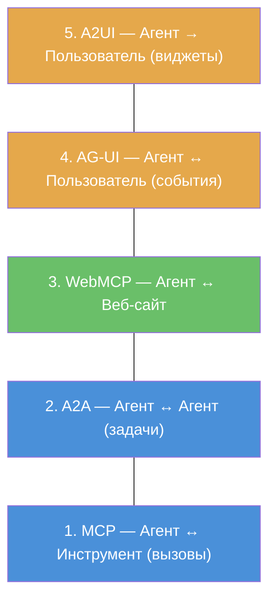

# Лекция 5: Стек протоколов и будущее межагентной коммуникации

## Введение: От двух протоколов к пяти уровням

В прошлой лекции мы разобрали MCP и A2A — два фундаментальных протокола, которые покрывают взаимодействие агента с инструментами и с другими агентами. Если бы агенты существовали только в серверных процессах и общались только друг с другом — этого было бы достаточно.

Но агенты вышли за пределы серверов. Они работают в браузерах, обращаются к веб-сайтам, генерируют пользовательские интерфейсы и взаимодействуют с людьми в реальном времени. Для каждого из этих сценариев появился свой протокол — и вместе они образуют **стек из пяти уровней**, который к марту 2026 года стал emerging consensus в индустрии.

Аналогия с сетевой моделью OSI полезна. OSI описывает семь уровней сетевого взаимодействия: от физического кабеля до приложения. Вы не используете все семь уровней каждый раз — но вы знаете, что они есть и как сочетаются. То же самое с агентным стеком: не каждая система использует все пять уровней, но понимание стека целиком позволяет принимать осознанные архитектурные решения.

В этой лекции мы поднимемся по стеку снизу вверх: от уже знакомых MCP и A2A к WebMCP, AG-UI и A2UI. А затем посмотрим на протоколы, которые работают не внутри стека, а рядом с ним — как ортогональные слои.

---

## Часть 1: Пятиуровневый стек

Стек выглядит так:

Каждый уровень решает свою задачу, и каждый появился из конкретной боли — не из абстрактного желания «добавить ещё один протокол». Уровни 1-2 мы разобрали в прошлой лекции. Уровни 3-5 — тема этой.

Стек не означает, что каждая система должна использовать все пять уровней. Это **меню**, а не обязательный набор. Внутренняя MAS без веб-интерфейса может обойтись только MCP + A2A. Система с пользовательским интерфейсом добавит AG-UI для отображения прогресса. Агент, работающий с веб-сайтами, подключит WebMCP. Вы выбираете уровни в зависимости от архитектуры — как выбираете библиотеки для проекта.

---

## Часть 2: WebMCP — агенты получают доступ к вебу

### Проблема: веб создан для людей

Когда агент хочет получить информацию с веб-сайта, у него два пути. Первый — использовать поисковый API (Tavily, Perplexity), который вернёт текстовую выжимку. Это работает для простых запросов, но не даёт доступа к интерактивным функциям сайта: нельзя добавить товар в корзину, заполнить форму, настроить фильтры.

Второй путь — скрейпинг HTML. Агент загружает страницу, парсит DOM, извлекает данные. Это хрупко: любое изменение вёрстки ломает парсер, а большинство сайтов активно противодействуют скрейпингу через CAPTCHA, rate limiting и динамическую загрузку контента.

Корневая проблема в том, что веб-сайты **созданы для людей с браузером**, а не для агентов с JSON. Агент не может «нажать кнопку», «заполнить форму» или «выбрать из каталога» стандартным способом. Каждый сайт — отдельная интеграция, каждая интеграция — ручная работа. Это как если бы для каждого принтера нужен был свой уникальный драйвер, написанный вручную.

А ведь именно для принтеров эту проблему решили — стандартными драйверами и протоколами. WebMCP делает то же самое для веба.

### Что такое WebMCP

WebMCP — предложенный стандарт W3C, который позволяет веб-сайтам **экспортировать структурированные инструменты** для AI-агентов. Если MCP — это USB-порт для подключения инструментов к агенту, то WebMCP — это USB-порт, встроенный в каждый веб-сайт.

Идея проста: сайт объявляет: «У меня есть инструмент `search_products(query, category, price_range)`, инструмент `add_to_cart(product_id, quantity)` и инструмент `checkout(payment_method)`». Агент обнаруживает эти инструменты через стандартный механизм, вызывает их и получает структурированные ответы — без парсинга HTML, без хрупких CSS-селекторов, без обхода защит от ботов.

Сравните два подхода для задачи «найди на сайте X ноутбук дешевле 1000$ с 16GB RAM»:

**Без WebMCP** (сегодня):

1. Открыть страницу через headless browser (Playwright/Selenium)
2. Найти поле поиска по CSS-селектору (который может измениться)
3. Ввести текст, нажать Enter
4. Дождаться загрузки результатов (сколько ждать?)
5. Найти фильтры по CSS (другой селектор)
6. Заполнить фильтры (ещё селекторы)
7. Распарсить результаты (ещё селекторы)
8. Надеяться, что сайт не заблокирует за автоматизацию

**С WebMCP** (будущее):

1. Вызвать `search_products(query="ноутбук", max_price=1000, min_ram=16)`
2. Получить JSON с результатами

### Два API

WebMCP предлагает два способа объявления инструментов:

**Декларативный** — через HTML-формы. Уже существующие формы на сайте (поиск, фильтры, заказ) становятся доступны агенту как структурированные инструменты. Сайту не нужно писать новый код — достаточно добавить атрибуты `webmcp-tool` и `webmcp-description` к существующим `<form>` и `<input>` элементам. Аналогия: как `robots.txt` не требует изменений в коде сайта — только создать файл. Декларативный API превращает каждую форму в MCP-инструмент автоматически.

**Императивный** — через JavaScript API. Сайт регистрирует произвольные инструменты через `navigator.ai.tools.register(...)` — с именем, описанием, параметрами и кастомным обработчиком. Более мощный подход, позволяющий экспортировать функциональность, которая не выражается через формы: интерактивные визуализации, сложные конфигураторы, real-time данные, вычисления на стороне клиента.

### Статус на март 2026

Chrome 146 (стабильный релиз 10 марта 2026) поставляется с WebMCP за feature flag — это первая реальная реализация в браузере. Спецификация разрабатывается через W3C с участием Google, Microsoft, Mozilla и Apple. Chrome — пока единственный браузер с рабочей реализацией; поддержка в других браузерах ожидается к середине-концу 2026 года.

Важно понимать, что WebMCP пока **не production-ready**. Feature flag означает, что пользователь должен вручную включить поддержку в настройках. Веб-сайтов с WebMCP-разметкой — единицы. Но направление задано: как HTTP превратил документы из статических файлов в интерактивные приложения, WebMCP превратит веб-сайты из «страниц для людей» в «API для агентов».

Для нашего курса WebMCP важен не как инструмент для использования прямо сейчас, а как архитектурный тренд. Если вы проектируете MAS, которая взаимодействует с вебом, закладывайте в архитектуру возможность перехода от скрейпинга к WebMCP — когда сайты начнут его поддерживать.

---

## Часть 3: AG-UI — агент разговаривает с интерфейсом

### Проблема: пользователь не видит, что происходит

Когда одиночный агент работает, пользователь видит поток текста — стриминг ответа модели. Это достаточно для простых задач: вопрос → ответ. Но когда работает мультиагентная система, одного потока текста не хватает.

Пользователь хочет знать: какой агент сейчас работает? Какую задачу выполняет? Почему передал управление другому? Сколько ещё ждать? Можно ли вмешаться? Без этой информации MAS для пользователя — чёрный ящик: отправил запрос, ждёшь минуту, получаешь результат (или ошибку). Это неприемлемо для production-систем, где пользователь должен понимать и контролировать процесс.

До AG-UI каждый фреймворк изобретал свой способ показать прогресс: LangGraph — через streaming events, CrewAI — через verbose mode, Agents SDK — через tracing UI. Каждый формат — свой, несовместимый с остальными. Фронтенд-разработчик, который хочет построить UI для агентной системы, должен изучать API каждого фреймворка отдельно.

### Что такое AG-UI

AG-UI (Agent-User Interaction Protocol) стандартизирует поток событий от агента к пользовательскому интерфейсу. Вместо того чтобы каждый фронтенд изобретал свой формат, AG-UI определяет общую структуру: типы событий, их payload, механизм подписки.

Если MCP — это «как агент обращается к инструментам», A2A — «как агент общается с другим агентом», то AG-UI — «как агент рассказывает пользователю, что он делает».

Поток событий AG-UI — это не просто стриминг текста. Это **семантические события** с типами и структурой. Каждое событие несёт тип (`agent_start`, `tool_call`, `tool_result`, `agent_handoff`, `text_delta`, `agent_end`), имя агента, и payload — контекст того, что произошло. Поток читается как лог: «исследователь начал работу», «вызван инструмент web_search», «получено 5 результатов», «передача управления писателю», «писатель генерирует текст...», «готово».

Фронтенд-компоненты (React, Vue, Svelte) подписываются на этот поток и рендерят прогресс: показывают, какой агент активен, какие инструменты вызываются, какие промежуточные результаты получены. Один и тот же фронтенд работает с агентами на LangGraph, CrewAI или любом другом фреймворке — если тот поддерживает AG-UI.

### Почему это важно для MAS

В одноагентной системе достаточно стримить текст. В MAS — нет. Представьте систему из пяти агентов, которая работает минуту:

Без AG-UI пользователь видит: пустой экран... пустой экран... пустой экран... через 60 секунд — готовый результат. Или ошибка. Непонятно, что произошло.

С AG-UI пользователь видит: «Исследователь ищет информацию (3 из 10 источников)» → «Исследователь завершил, передаёт данные Аналитику» → «Аналитик обрабатывает данные» → «Аналитик запросил уточнение (ожидание ввода)» → «Писатель генерирует отчёт (40% готово)» → «Готово».

Это разница между такси без GPS и такси с Uber-трекером: оба доставят до места, но во втором случае вы знаете, что происходит.

AG-UI также позволяет реализовать human-in-the-loop прямо в интерфейсе: агент отправляет событие `input_required`, UI показывает форму, пользователь отвечает, событие возвращается агенту. Стандартный механизм, работающий с любым фреймворком.

---

## Часть 4: A2UI — агент генерирует интерфейс

### От событий к виджетам

AG-UI передаёт события — «что происходит». Фронтенд сам решает, как это визуализировать. Но иногда агент лучше знает, какой формат представления подходит для результата.

A2UI (Agent-to-User Interface) идёт на шаг дальше: вместо «передай данные, а UI пусть разберётся» агент говорит «покажи пользователю таблицу с сортировкой» или «предложи выбор из трёх вариантов в виде карточек».

Представьте: агент-аналитик обработал данные и хочет показать результат. Через AG-UI он отправит JSON с числами — и фронтенд покажет их как текст. Через A2UI он скажет: «покажи столбчатую диаграмму с выделением максимума» — и фронтенд отрендерит именно это.

### Как это работает

A2UI определяет набор **виджетов** — стандартных UI-компонентов, которые агент может запросить:

- **Таблицы** — с сортировкой, фильтрацией, пагинацией
- **Графики** — столбчатые, линейные, круговые
- **Карточки** — для выбора из вариантов
- **Формы** — для сбора структурированного ввода
- **Прогресс-бары** — для отображения длительных операций

Агент не генерирует HTML или React-код (это было бы и небезопасно, и хрупко). Он отправляет **спецификацию виджета** — «что показать» и «какие данные», а фронтенд рендерит из предопределённого набора компонентов. Это как в мобильных нотификациях: приложение отправляет структуру (заголовок, текст, кнопки), а ОС рендерит в нативном стиле.

A2UI разработан Google и тесно интегрирован с Agent Development Kit (ADK). На март 2026 это самый ранний протокол в стеке — менее зрелый, чем MCP, A2A или даже AG-UI. Но идея «агент решает, как визуализировать результат» — мощная, и мы увидим её развитие.

### AG-UI + A2UI: не замена, а дополнение

AG-UI и A2UI — не конкуренты. Они работают на одном уровне, но решают разные задачи:

- **AG-UI** передаёт **поток событий** (что происходит) — это runtime-протокол для отображения прогресса
- **A2UI** определяет **визуализацию результатов** (как показать) — это presentation-протокол для отображения данных

В мультиагентной системе пользователю нужно и то, и другое: видеть, что происходит (AG-UI), и удобно просматривать результаты (A2UI).

---

## Часть 5: SLIM — безопасность как ортогональный слой

### Зачем нужен отдельный слой безопасности

MCP, A2A, WebMCP определяют **что** и **как** передаётся между агентами. Но они не полностью отвечают на вопрос **кому можно доверять** в масштабе. A2A поддерживает аутентификацию через Agent Card и пять механизмов аутентификации — но не определяет, как управлять идентичностями сотен агентов, как обеспечивать end-to-end шифрование в группах или как защищаться от компрометации посредников.

Аналогия: HTTPS шифрует соединение между двумя точками. Но если вам нужен зашифрованный групповой чат, HTTPS недостаточно — нужен протокол группового шифрования поверх транспорта. То же самое для агентов: A2A шифрует point-to-point, но для группы из десяти агентов, работающих над одной задачей, нужен отдельный слой.

SLIM решает именно эти задачи. На март 2026 SLIM оформлен как **IETF Internet-Draft** — проект стандарта, рассматриваемый инженерным сообществом интернета.

### Ключевая идея: MLS для агентов

Технической основой SLIM является **Message Layer Security** (MLS) — протокол группового шифрования, разработанный для мессенджеров (именно на нём построены зашифрованные чаты). SLIM адаптирует MLS для агентных коммуникаций.

Что даёт MLS в агентном контексте:

**Квантово-устойчивое шифрование.** Алгоритмы, которые останутся безопасными даже с появлением квантовых компьютеров. Звучит как параноидальный футуризм — но для финансовых и медицинских систем, которые обрабатывают данные с горизонтом хранения в десятилетия, это реальное требование. Если данные зашифрованы алгоритмом, который квантовый компьютер сломает через 10 лет — они уже скомпрометированы сегодня (атака «harvest now, decrypt later»).

**Эффективное управление группами.** Когда агент добавляется в мультиагентную систему или удаляется из неё, не нужно перешифровывать все каналы. MLS обновляет ключи инкрементально — это критично для динамических MAS, где агенты создаются и уничтожаются на лету (паттерн Dynamic Spawning).

**Два типа сессий.** Point-to-point (для вызовов инструментов и прямых запросов между двумя агентами) и group (для координации и broadcast). Это точно соответствует паттернам MAS: один-к-одному (supervisor → worker) и один-ко-многим (broadcast, voting, round-robin discussion).

На март 2026 доступны SDK на Python и Go. JavaScript/TypeScript, C# и Kotlin — в разработке.

SLIM — **не конкурент** MCP или A2A. Это ортогональный слой, который работает **поверх** любого из них. Если MCP — это «какие инструменты доступны», A2A — «какие задачи можно делегировать», то SLIM — «кому можно доверять и как защитить коммуникацию». Вы можете использовать MCP + A2A без SLIM (для внутренних систем с доверенной сетью) или добавить SLIM, когда появятся требования к шифрованию и управлению идентичностями.

---

## Часть 6: Протоколы на периферии

Помимо основного стека, в 2025–2026 появились протоколы, решающие более узкие, но важные задачи. Они заслуживают упоминания, потому что каждый из них может стать частью будущего стека.

### ANP (Agent Network Protocol)

A2A строится вокруг централизованной модели: Agent Cards публикуются на серверах, TSC (Technical Steering Committee) координирует развитие, AAIF управляет стандартом. Это надёжно и предсказуемо — но что если вы хотите децентрализацию?

ANP (Agent Network Protocol) позиционирует себя как «HTTP агентного веба» — протокол для **одноранговой, децентрализованной** коммуникации агентов в открытом интернете. Если A2A — это как корпоративная телефонная сеть (централизованная, управляемая), то ANP — как интернет (децентрализованный, открытый). Агенты обнаруживают друг друга через DNS и HTTPS — как веб-сайты — без центрального реестра.

ANP оформлен как IETF Internet-Draft. Доступны SDK на Python и Go, а также мост `mcp2anp` для интеграции с MCP-серверами. Пока ANP остаётся экспериментальным — но для сценариев, где централизованное управление нежелательно (privacy-first системы, peer-to-peer маркетплейсы агентов), он может стать альтернативой A2A.

### x402 (Coinbase)

x402 решает проблему, которая кажется футуристичной, но уже актуальна: **как агент платит за услуги другого агента?**

Если агент A делегирует задачу агенту B через A2A, и агент B — платный сервис, как происходит оплата? Кредитная карта? Агенты не имеют кредитных карт. Биллинг по подписке? Но агенты выбирают исполнителей динамически, и количество вызовов непредсказуемо. Нужны **микроплатежи между машинами** — без участия человека, без задержек, без минимальных сумм.

x402 использует HTTP-код **402 (Payment Required)** — тот самый код, который был зарезервирован в HTTP/1.1 ещё в 1999 году «для будущего использования». 25 лет спустя будущее наступило. Агент запрашивает услугу, получает 402 с ценой и платёжными инструкциями, оплачивает стейблкоинами и получает результат. Весь цикл — автоматический, машина-машина.

Протокол разработан Coinbase совместно с Cloudflare. На март 2026 зафиксировано более 50 миллионов тестовых транзакций.

Для курса x402 — это пример того, как агентные протоколы выходят за пределы чисто технических вопросов в **экономику**. Если агенты умеют делегировать задачи (A2A) и платить за них (x402), появляется **рынок агентных услуг** — экосистема, где агенты покупают и продают возможности друг другу без участия человека. Звучит как научная фантастика — но технические компоненты уже существуют.

---

## Часть 7: Куда всё движется

### AAIF как центр гравитации

К марту 2026 ландшафт протоколов структурирован вокруг **Agentic AI Foundation**. MCP и A2A — под управлением AAIF. WebMCP разрабатывается через W3C при участии тех же компаний. AG-UI и A2UI пока более фрагментированы, но движутся к стандартизации.

146 организаций-членов AAIF — это не абстрактная цифра. Это означает, что когда вы строите мультиагентную систему на MCP + A2A, вы не привязываетесь к одному вендору. Ваш агент на LangGraph может общаться через A2A с агентом на CrewAI, который использует MCP-серверы, написанные для Google ADK. Протоколы — это клей, который делает экосистему возможной. Как HTTP позволяет браузеру Chrome открывать сайт на сервере Nginx — протоколы позволяют агентам из разных миров работать вместе.

### Чего ожидать

**MCP** готовит следующую версию спецификации к июню 2026 — с улучшениями в stateless транспорте и сессиях. **A2A 1.0** стабилен и сфокусирован на adoption. **WebMCP** будет расширять поддержку в браузерах. **SLIM** и **ANP** проходят через процесс IETF.

Для практической работы **сейчас** важны два протокола: MCP (зрелый, 10 000+ серверов) и A2A (стабильный v1.0, растущее adoption). Остальные — WebMCP, AG-UI, A2UI, ANP, x402 — стоит знать и отслеживать, но в production-системах пока преждевременно закладывать зависимость от них.

### Практический совет

Если вы проектируете MAS сегодня:

- **Используйте** MCP для инструментов. Зрелый, стабильный, огромная экосистема.
- **Используйте** A2A для межсистемных агентов, если у вас есть такой сценарий. Стабильный v1.0.
- **Отслеживайте** WebMCP, если ваши агенты работают с вебом. Через год это может стать стандартным подходом.
- **Отслеживайте** AG-UI, если строите пользовательский интерфейс для MAS. Пока можно использовать LangGraph streaming + кастомные события, но AG-UI унифицирует это.
- **Знайте о** SLIM, ANP, x402 — для контекста и архитектурного мышления, но не для production-зависимостей.

---

## Итоги

Индустрия движется от двух протоколов к стеку из пяти уровней:

**MCP** (инструменты) → **A2A** (агенты) → **WebMCP** (веб) → **AG-UI** (события UI) → **A2UI** (виджеты UI)

Поверх стека — **SLIM** (безопасность, шифрование, управление идентичностями). На периферии — **ANP** (децентрализация) и **x402** (платежи).

Каждый уровень появился из конкретной боли: MCP — «как стандартно подключать инструменты», A2A — «как агенты общаются между системами», WebMCP — «как агенты работают с вебом», AG-UI — «как показать пользователю, что происходит», A2UI — «как агент может генерировать интерфейс».

Два практически важных вывода. Первый: **MCP + A2A** — это то, что нужно знать и уметь использовать прямо сейчас. Второй: стек продолжает расти, и архитектуру мультиагентных систем стоит проектировать с учётом того, что протоколы взаимодействия станут такой же стандартной частью инфраструктуры, как HTTP стал для веба.