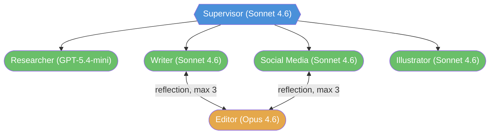
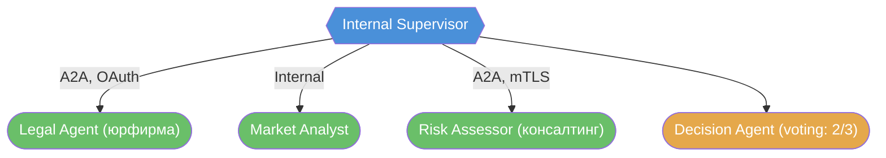
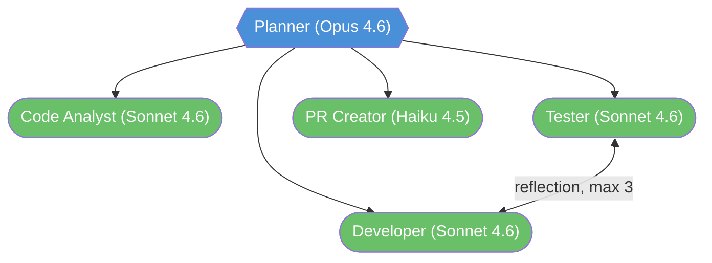

# Лекция 7: Дизайн мультиагентных систем в реальном мире

## Введение: От ноутбука к архитектуре

За шесть лекций мы накопили серьёзный арсенал. 14 паттернов оркестрации и коллаборации. 9 комбинаций. Два ключевых протокола и стек из пяти уровней. Пять фреймворков с разными философиями. Осталось ответить на главный вопрос: **как всё это применять на практике?**

В ноутбуке всё просто. Вы берёте паттерн Supervisor + Reflection, пишете граф, запускаете — работает. Но в реальном проекте перед кодом стоит цепочка решений: нужна ли MAS вообще? Сколько агентов? Какой паттерн? Как декомпозировать задачу? Где провести границы между агентами? Какие модели каждому? Как тестировать?

Каждое из этих решений — компромисс. Больше агентов — больше специализации, но и больше стоимости координации. Более мощная модель — лучше качество, но и выше стоимость. Shared state — проще, но хуже масштабируется. A2A — гибче, но сложнее в настройке.

Эта лекция — набор инструментов для принятия этих решений. Не абстрактные принципы, а конкретные чеклисты, антипаттерны и разбор реальных архитектур. К концу лекции у вас будет фреймворк для проектирования MAS от начальной идеи до архитектурной схемы.

---

## Часть 1: Решение «один агент или система»

### Чеклист: когда MAS оправдана

Мультиагентная система — не цель, а средство. Она оправдана, когда присутствует хотя бы два из пяти условий.

**Разнородные компетенции.** Задача требует принципиально разных навыков — исследование, анализ данных, генерация текста, проверка кода. Ключевое слово — «принципиально разных». Если разница только в промпте («напиши формально» vs «напиши неформально»), это один агент с параметром, а не два агента. Но если исследователю нужен поисковый API, а аналитику — доступ к базе данных, и их промпты описывают совершенно разные мыслительные процессы — это два агента.

**Длинный контекст.** Задача порождает больше токенов, чем разумно скармливать одному агенту. Обратите внимание: не «больше, чем контекстное окно», а «больше, чем разумно». Даже если технически контекстного окна хватает, качество работы LLM падает с ростом контекста — модель начинает «терять» информацию из середины длинного промпта. Декомпозиция на агентов позволяет каждому работать с компактным, сфокусированным контекстом.

**Параллелизм.** Части задачи независимы и могут выполняться одновременно. 100 документов для анализа — это потенциально 100 параллельных агентов через `Send()`, а не один последовательный. Но параллелизм оправдан, только если время выполнения критично: если задача может работать 10 минут последовательно и это нормально — параллелизм добавляет сложность без пользы.

**Верификация.** Результат критичен, и нужна независимая проверка. Один агент не может качественно проверить сам себя — это как редактировать собственный текст. Независимый агент-рецензент с другим промптом, возможно другой моделью, даёт честную обратную связь. Паттерны Reflection, Debate, Voting — все про это.

**Масштабирование команды.** Над системой работают несколько разработчиков, и каждый отвечает за своего агента. MAS позволяет разделить ответственность: команда A отвечает за агента-исследователя (его промпт, инструменты, тесты), команда B — за агента-писателя. Каждый агент — свой модуль с чётким интерфейсом.

Если ни одно из условий не выполняется — один агент с хорошим промптом и набором инструментов будет проще, дешевле и надёжнее.

### Антипаттерн: преждевременная декомпозиция

Самая частая ошибка — создание MAS для задачи, которую решает один агент. «Давайте сделаем агента-планировщика, который создаст план, агента-исполнителя, который выполнит каждый пункт, и агента-валидатора, который проверит результат» — для задачи «ответь на вопрос по документу».

Каждый дополнительный агент — это дополнительный вызов LLM (стоимость), дополнительная точка отказа (надёжность) и дополнительная сложность отладки (developer experience). Три агента вместо одного — это не 3x стоимости, а скорее 5-10x: каждый агент получает контекст (входные токены), генерирует результат (выходные токены), и передаёт результат следующему (снова входные токены). Координация съедает больше, чем работа.

Правило: **начинайте с одного агента**. Добавляйте второго, когда первый доказал свои ограничения **на реальных данных** — не на гипотетических сценариях. «Мне кажется, что одному агенту будет сложно» — это не доказательство. «Я протестировал на 50 примерах, и в 40% случаев одного агента не хватает, потому что...» — это доказательство.

### Антипаттерн: агент вместо инструмента

Не каждая подзадача требует отдельного агента. Если подзадача детерминирована (всегда один и тот же алгоритм), не требует рассуждений LLM и выполняется за миллисекунды — это инструмент, не агент.

«Агент-калькулятор», который вызывает LLM для сложения чисел, или «агент-форматтер», который оборачивает текст в JSON через промпт LLM — пустая трата денег и латентности. Калькулятор — это функция `lambda a, b: a + b`. Форматтер — это `json.dumps()`. Не нужно рассуждение модели для операций, которые решаются детерминированным кодом.

Хороший тест: **если вы можете описать поведение «агента» без слов «решает», «анализирует», «выбирает», «рассуждает» — это инструмент**. «Отправляет email» — инструмент. «Анализирует тон письма, решает, кому перенаправить, и формулирует ответ» — агент.

---

## Часть 2: Декомпозиция задачи на агентов

Когда решение принято — MAS нужна — следующий вопрос: как разбить задачу? Существует три основных стратегии, и часто используется их комбинация.

### По компетенциям

Самый естественный и частый способ — разделить по **областям знаний**. Агент-исследователь знает, как искать информацию: формулировать запросы, оценивать источники, извлекать факты. Агент-аналитик знает, как интерпретировать данные: строить гипотезы, считать метрики, находить закономерности. Агент-писатель знает, как структурировать текст: выбирать стиль, организовывать аргументацию, делать материал понятным аудитории.

Каждый получает сфокусированный промпт с описанием **одной** компетенции и релевантные инструменты. Исследователю — поисковые API. Аналитику — базы данных и вычислительные инструменты. Писателю — шаблоны и стайл-гайды.

Этот подход хорош, когда этапы задачи **линейны или слабо связаны**: сначала исследование, потом анализ, потом генерация. Паттерн Pipeline. Или когда каждый этап может потребовать несколько итераций — тогда Supervisor, который возвращает задачу нужному агенту.

### По данным

Альтернативный подход — разделить по **данным**, а не по компетенциям. Все агенты делают одно и то же (например, анализ документа), но каждый работает со своей порцией данных. 100 документов → 100 агентов → результаты сходятся в один.

Этот подход хорош для задач с **высоким параллелизмом**, где каждый элемент данных обрабатывается независимо. Паттерн Map-Reduce или Dynamic Spawning через `Send()`. Типичные сценарии: анализ большой коллекции документов, обработка batch-запросов, генерация вариантов для A/B-тестирования.

Важный нюанс: агенты по данным обычно **идентичны** — один промпт, одни инструменты, одна модель. Различается только входной элемент данных. Это упрощает тестирование: достаточно протестировать одного агента на репрезентативной выборке, и результат масштабируется на всех.

### По уровням доверия

Третий подход — разделить по **уровням доверия**. Это архитектурный принцип **least privilege**, реализованный через декомпозицию на агентов.

Агент с доступом к интернету не должен иметь доступ к внутренней базе данных — потому что интернет-агент обрабатывает внешний контент, который может содержать prompt injection. Агент с правом записи в файловую систему не должен иметь доступ к API платежей — одна галлюцинация, и агент «оплатил» что-то не то. Каждый агент получает **минимально необходимый набор прав**.

Этот подход особенно важен для систем, работающих с чувствительными данными или внешними источниками. Паттерн Router/Triage, где верхний уровень классифицирует запрос и направляет его агенту с соответствующим уровнем доступа. Или Hierarchical Supervisor, где каждая группа агентов работает в своём sandbox-е.

На практике декомпозиция обычно **комбинирует** несколько подходов. По компетенциям на верхнем уровне (исследование, анализ, генерация), по данным для параллельных задач внутри каждого этапа (100 документов → 100 параллельных анализов), по доверию для изоляции внешних и внутренних операций.

---

## Часть 3: Архитектурные решения

### Shared state vs message passing

Когда агенты определены, встаёт вопрос: **как они будут общаться?**

**Shared state** (разделяемое состояние) — подход LangGraph по умолчанию. Один `TypedDict`, доступный всем узлам. Исследователь записывает в `research`, писатель читает `research` и записывает в `draft`. Просто, быстро, удобно для отладки: в любой момент можно посмотреть полное состояние системы — все поля, все значения.

Но shared state плохо масштабируется. Когда в состоянии 20 полей и 10 агентов, понять, кто что записал и почему — серьёзная задача. Новый агент может случайно перезаписать данные другого, если неправильно настроены reducer'ы. Все агенты связаны через общую структуру данных, что затрудняет независимую разработку.

**Message passing** (передача сообщений, через A2A) — противоположный подход. Каждый агент — чёрный ящик: вход, выход, никаких побочных эффектов на чужое состояние. Агент A отправляет задачу агенту B, B работает в своём изолированном контексте, возвращает результат. A не знает, как B устроен внутри. B не знает, кто ещё работает в системе.

Message passing лучше изолирует агентов. Тестирование проще: каждого агента можно протестировать отдельно, подавая ему входные данные и проверяя выходные. Замена одного агента на другого (например, смена реализации или фреймворка) не затрагивает остальных — пока интерфейс (формат входа/выхода) остаётся прежним. Но настройка сложнее: нужен A2A, нужна аутентификация, нужна обработка таймаутов и ошибок сети.

**Практический совет:** используйте shared state **внутри одного «отдела»** — группы тесно связанных агентов, которые развиваются одной командой. И message passing **между «отделами»** — независимыми системами, которые развиваются разными командами. Как в компании: внутри команды — общий Slack-канал (быстро, неформально). Между командами — задачи в Jira (структурированно, с SLA, с трекингом).

### Subagents-as-tools vs handoffs vs shared graph

В LangGraph есть три способа координации агентов — и каждый подходит для разных сценариев.

**Subagents-as-tools** — supervisor вызывает агентов как инструменты. Каждый субагент — это скомпилированный подграф, обёрнутый в инструмент. Supervisor видит только результат — компактный текст или структурированные данные — а не весь внутренний контекст агента (промежуточные рассуждения, вызовы инструментов, черновики). Это **рекомендуемый паттерн на март 2026**, и вот почему: он даёт максимальный контроль над context engineering. Supervisor не загрязняется деталями работы субагентов — видит только то, что нужно для принятия следующего решения.

**Handoffs** — агент сам решает, кому передать управление. Через `Command(goto=..., graph=Command.PARENT)`. Нет центрального координатора — каждый агент знает, кому передать эстафету. Подходит для сценариев, где каждый агент лучше знает, что делать дальше: customer support с маршрутизацией по типу запроса (клиент спрашивает про оплату → billing agent → клиент спрашивает про технику → technical agent), pipeline с условными переходами.

**Shared graph** — все агенты в одном графе, координация через рёбра и условные переходы. Максимальная прозрачность и контроль: вы видите весь граф, все переходы, все условия. Но не масштабируется для больших систем: граф из 20 узлов с 40 рёбрами и 15 условными переходами — это визуальный хаос и кошмар для поддержки.

На практике: **subagents-as-tools для большинства систем**. Handoffs — для простых пайплайнов с routing. Shared graph — для маленьких, хорошо определённых workflow до 5-7 узлов.

### Глубина иерархии

Одноуровневая система (supervisor + workers) покрывает 80% случаев. Двухуровневая (supervisor → sub-supervisors → workers) — ещё 15%. Три и более уровня — почти никогда не нужны на практике.

Каждый уровень иерархии добавляет **латентность** (дополнительный вызов LLM для координации — это 1-5 секунд) и **риск ошибки** (координатор может неправильно понять задачу, неправильно выбрать субагента, неправильно интерпретировать результат). Два уровня = два шанса ошибиться в маршрутизации, прежде чем задача дойдёт до исполнителя.

Правило: если можете решить задачу одним уровнем — решайте одним. Второй уровень добавляйте только когда у supervisor'а больше 5-7 субагентов и они логически группируются (исследовательская группа, группа генерации, группа проверки).

### Выбор модели для каждого агента

Не все агенты в системе требуют одинаковой модели. Это одно из главных преимуществ MAS перед одноагентной системой: вы можете оптимизировать стоимость, назначив каждому агенту модель, соответствующую сложности его задачи.

**Координатор** (supervisor, router) — часто достаточно быстрой и дешёвой модели. Его задача — выбрать следующего агента, а не решать сложную проблему. GPT-5.4-mini, Claude Haiku 4.5, Gemini Flash-Lite. Исключение: если координатор принимает сложные решения (выбор из 10 агентов на основе анализа промежуточных результатов), нужна модель посерьёзнее.

**Рабочие агенты** (исследователь, писатель, аналитик) — средний уровень. Claude Sonnet 4.6, GPT-5.4, Gemini 3.1 Pro. Достаточно мощные для задачи, не слишком дорогие для массового использования.

**Критики и валидаторы** (редактор, рецензент, агент-оценщик) — часто нужна лучшая доступная модель. Оценка качества — более сложная задача, чем генерация. Парадокс: чтобы найти ошибку в тексте, нужно понимать текст глубже, чем для его написания. Claude Opus 4.6, GPT-5.4 Pro.

Принцип: **начните с дешёвой модели для всех, повышайте при доказанной необходимости**. «Доказанной» означает: вы замерили качество на тестовом наборе и увидели, что дешёвая модель не справляется с конкретной ролью. Не «мне кажется, что для критика нужен Opus», а «Haiku пропускает 40% ошибок в тестах, а Opus — только 5%».

---

## Часть 4: Разбор реальных архитектур

Теория без примеров — абстракция. Давайте разберём три кейса, каждый из которых демонстрирует свой набор архитектурных решений. Для каждого кейса проследим ход мысли архитектора: от задачи через решения к финальной схеме.

### Кейс 1: Система создания контента

**Задача.** Из одного бриф-документа создать пакет контента: лонгрид (2000+ слов), серию постов для трёх соцсетей и набор промптов для иллюстраций.

**Ход мысли.** Задача явно распадается на роли: кто-то исследует тему, кто-то пишет длинный текст, кто-то адаптирует для соцсетей, кто-то генерирует промпты для иллюстраций. Это четыре разных компетенции — чеклист из Части 1 даёт первое условие (разнородные компетенции). Лонгрид и посты для соцсетей можно генерировать параллельно, после завершения исследования — второе условие (параллелизм). Качество контента критично — третье (верификация). MAS оправдана.

Какой паттерн? Нужен центральный координатор (supervisor), потому что порядок зависит от результатов: сначала исследование (без него нет данных), потом параллельно три генерации, потом проверка. Supervisor + Pipeline + Reflection.

**Решения.**

Supervisor координирует порядок: сначала research, потом параллельно writer + social + illustrator. Используем subagents-as-tools — supervisor видит только результаты, не перегружаясь промежуточными рассуждениями агентов.

Editor — **один агент**, вызываемый из разных контекстов. Он проверяет и лонгрид, и посты для соцсетей. Промпт один: «ты — строгий редактор, найди проблемы в тексте». Контекст разный — LangGraph передаёт разные данные. Это переиспользование через subgraph: определяем editor-граф один раз, используем в нескольких местах.

Researcher — на быстрой дешёвой модели (GPT-5.4-mini). Задача исследователя — найти факты, а не рассуждать. Дешёвая модель справляется отлично. Editor — на дорогой модели (Claude Opus 4.6). Оценка качества текста требует глубокого понимания. Остальные агенты — на средней модели (Claude Sonnet 4.6).

**Архитектура:**

**Протоколы:** Всё внутри одного графа LangGraph — shared state, без A2A. Инструменты через MCP (Tavily для поиска, DALL-E для генерации изображений). Один процесс, одна кодовая база, одна команда.

> Полный пример реализации: examples_07_design.ipynb, часть 1

### Кейс 2: Мультиорганизационный due diligence

**Задача.** Финансовая компания анализирует сделку (M&A due diligence). Нужны: юридическая проверка (партнёрская юрфирма), рыночный анализ (внутренний отдел) и оценка рисков (внешняя консалтинговая компания).

**Ход мысли.** Здесь ключевое ограничение — **организационные границы**. Юрфирма не предоставит доступ к своему коду или внутренней инфраструктуре. Консалтинговая компания — тем более. Разделяемое состояние через `TypedDict` физически невозможно. Нужен протокол для межорганизационной коммуникации — A2A.

Внутренний Market Analyst может жить в том же графе, что и внутренний Supervisor. Но Legal Agent и Risk Assessor — внешние, доступны только через стандартный протокол. A2A идеален: Agent Card для обнаружения, Task lifecycle для длительных задач (юрпроверка может занять часы), аутентификация через OAuth или mTLS.

Финальное решение принимается через **voting**: каждый из трёх агентов (юрист, аналитик, оценщик рисков) выносит вердикт «proceed» или «reject». Если 2 из 3 говорят «proceed» — сделка рекомендуется.

**Решения.**

Legal Agent и Risk Assessor — внешние A2A-агенты. Supervisor отправляет им задачи и ждёт завершения (polling или SSE). Аутентификация через OAuth 2.0 Client Credentials. Market Analyst — внутренний узел в графе Supervisor.

Decision Agent собирает три независимых оценки и принимает решение через voting (паттерн из лекции 2). Порог — 2 из 3.

**Архитектура:**

**Протоколы:** A2A для внешних агентов (long-running tasks, аутентификация), shared state для внутренних. MCP для доступа к внутренним базам данных и документам.

**Ключевой инсайт:** A2A используется не потому что он «лучше» shared state, а потому что это единственный способ, когда партнёры не дают доступ к своему коду. Архитектура определяется ограничениями, а не предпочтениями.

### Кейс 3: Платформа автоматизации кода

**Задача.** По issue в GitHub найти проблему в коде, написать fix, написать тесты, создать PR.

**Ход мысли.** Задача линейна: понять проблему → найти релевантный код → написать fix → проверить fix тестами → создать PR. Но между «написать fix» и «проверить тестами» есть цикл: тесты могут упасть, и fix нужно доработать.

Это классический Plan-and-Execute: сначала планирование (понять, что именно нужно сделать), потом выполнение шагов. С циклом Reflection между Developer и Tester.

**Решения.**

Planner создаёт план из 4-5 шагов на основе текста issue и контекста кодовой базы. Ему нужна хорошая модель — планирование сложнее исполнения.

Code Analyst читает код, находит проблему, определяет, какие файлы нужно изменить. Ему нужен MCP-сервер для доступа к файловой системе (чтение кода) и, возможно, для поиска по кодовой базе.

Developer пишет fix на основе плана и анализа. Tester пишет тесты и запускает их. Между Developer и Tester — **reflection loop**: тесты упали → Developer получает traceback и ошибки → исправляет → Tester перезапускает. Максимум 3 итерации, потом fail с описанием проблемы. Ограничение итераций критично: без него система может крутиться бесконечно, тратя деньги и время.

PR Creator — самый простой агент, фактически почти инструмент: собирает diff, генерирует описание PR, создаёт PR через GitHub API. Можно было бы сделать инструментом, но генерация качественного описания PR требует анализа всего контекста — так что это всё-таки агент.

**Архитектура:**

**Протоколы:** Всё внутри одного графа. MCP для GitHub (чтение/запись файлов, создание PR), MCP для shell (запуск тестов), MCP для filesystem (навигация по коду).

> Полный пример реализации: examples_07_design.ipynb, часть 2

---

## Часть 5: Чеклист проектирования

Перед тем как писать код мультиагентной системы, пройдите эти восемь вопросов. Каждый — развилка с конкретными вариантами ответа.

**1. Нужна ли MAS?** Пройдите чеклист из Части 1. Если нет двух условий из пяти (компетенции, контекст, параллелизм, верификация, масштабирование команды) — используйте одного агента. Серьёзно. Один хороший агент с `create_agent()`, правильным промптом и набором MCP-инструментов решает удивительно широкий класс задач.

**2. Как декомпозировать?** По компетенциям, по данным или по уровням доверия. Часто — комбинация. Запишите список агентов с одним предложением про каждого: «агент X делает Y, используя инструменты Z». Если не можете описать агента одним предложением — он слишком широкий и его нужно разбить.

**3. Какой паттерн?** Используйте матрицу из лекции 2. Ключевые развилки: нужен ли центральный координатор (supervisor vs handoffs)? Нужна ли верификация (reflection, voting)? Нужен ли параллелизм (map-reduce, dynamic spawning)? Можно ли обойтись линейным pipeline?

**4. Сколько уровней иерархии?** Один, если можете. Два, если агентов больше 7 и они логически группируются. Три — только если есть конкретная, доказанная причина. Каждый уровень — +1 вызов LLM на маршрутизацию, +1 точка отказа.

**5. Shared state или message passing?** Shared state внутри тесно связанных групп (одна команда, один процесс). Message passing (A2A) между независимыми системами (разные организации, разные кодовые базы, разные команды).

**6. Какую модель каждому агенту?** Принцип: начните с дешёвой, повышайте при доказанной необходимости. Координатору — nano/mini. Рабочим — средняя модель. Критику/валидатору — лучшая доступная. Замерьте качество на тестовом наборе перед окончательным решением.

**7. Где проходят границы безопасности?** Какой агент к чему имеет доступ. Least privilege: интернет-агент не видит внутреннюю БД, агент с правами записи не видит платёжный API. Для каждого агента запишите: «имеет доступ к X, Y; не имеет доступа к Z».

**8. Как тестировать?** Каждый агент тестируется **изолированно** — подаёте входные данные, проверяете выходные. Система тестируется **end-to-end** — на реальных сценариях от начала до конца. Тестирование мультиагентных систем — тема модуля 7 (Evaluation & Testing).

---

## Итоги

Дизайн мультиагентной системы — это цепочка архитектурных решений, каждое из которых — компромисс.

Один агент или система? Начинайте с одного. Shared state или message passing? Shared state внутри команды, A2A между командами. Supervisor или handoffs? Supervisor для большинства систем, handoffs для простых пайплайнов. Одна модель или tiering? Tiering — дешёвая для координации, дорогая для критики.

Хороший дизайн начинается с вопроса «нужна ли MAS вообще?» и заканчивается чеклистом из восьми пунктов. Между ними — выбор паттерна (лекция 2), протоколов (лекции 4-5) и, возможно, фреймворка (лекция 6).

Ключевое: **не существует универсальной архитектуры**. Система создания контента и платформа due diligence — обе мультиагентные, но устроены совершенно по-разному. Мастерство архитектора — в умении подобрать правильную комбинацию паттернов, протоколов и инструментов под конкретную задачу. Именно этому был посвящён весь модуль.